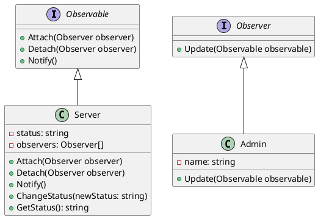

# Go

Мы — команда разработчиков, которая занимается созданием систем мониторинга состояния серверов. Наша задача — обеспечить надежное и своевременное уведомление о состоянии серверов, чтобы администраторы могли оперативно реагировать на любые изменения.

### Описание кейса

В этом кейсе мы рассмотрим, как применить паттерн "Наблюдатель" (Observer) для мониторинга состояния серверов. Паттерн "Наблюдатель" позволяет объектам (наблюдателям) получать уведомления о событиях, происходящих в других объектах (наблюдаемых). В нашем случае сервер будет наблюдаемым объектом, а администраторы — наблюдателями.

### Применение паттерна

Паттерн "Наблюдатель" поможет нам реализовать систему, в которой серверы будут уведомлять администраторов о своем состоянии. Это позволит администраторам своевременно реагировать на любые изменения, такие как перегрузка, отказ оборудования и т.д.

### Пример кода на Go

**1. Определение интерфейсов**


```go
// Интерфейс для наблюдаемых объектов (серверов)
type Observable interface {
    Attach(Observer)
    Detach(Observer)
    Notify()
}

// Интерфейс для наблюдателей (администраторов)
type Observer interface {
    Update(Observable)
}
```


**2. Реализация наблюдаемого объекта (сервера)**


```go
package main

import "fmt"

type Server struct {
    status    string
    observers []Observer
}

func (s *Server) Attach(observer Observer) {
    s.observers = append(s.observers, observer)
}

func (s *Server) Detach(observer Observer) {
    for i, obs := range s.observers {
        if obs == observer {
            s.observers = append(s.observers[:i], s.observers[i+1:]...)
            break
        }
    }
}

func (s *Server) Notify() {
    for _, observer := range s.observers {
        observer.Update(s)
    }
}

func (s *Server) ChangeStatus(newStatus string) {
    s.status = newStatus
    s.Notify()
}

func (s *Server) GetStatus() string {
    return s.status
}
```


**3. Реализация наблюдателя (администратора)**


```go
package main

import "fmt"

type Admin struct {
    name string
}

func (a *Admin) Update(observable Observable) {
    server := observable.(*Server)
    fmt.Printf("Администратор %s получил уведомление: состояние сервера изменилось на %s\n", a.name, server.GetStatus())
}
```


#### Пример использования


```go
package main

func main() {
    // Создаем сервер
    server := &Server{}

    // Создаем администраторов
    admin1 := &Admin{name: "Админ 1"}
    admin2 := &Admin{name: "Админ 2"}

    // Подписываем администраторов на уведомления от сервера
    server.Attach(admin1)
    server.Attach(admin2)

    // Изменяем состояние сервера
    server.ChangeStatus("Перегрузка")

    // Отписываем одного администратора
    server.Detach(admin1)

    // Изменяем состояние сервера еще раз
    server.ChangeStatus("Нормально")
}
```


### UML диаграмма

<figure><figcaption><p>UML диаграмма для паттерна "Наблюдатель"</p></figcaption></figure>





### Вывод для кейса

Паттерн "Наблюдатель" позволяет нам создать гибкую систему мониторинга состояния серверов. Администраторы могут подписываться на уведомления от серверов и своевременно получать информацию о любых изменениях. Это помогает оперативно реагировать на проблемы и поддерживать стабильную работу серверов.
