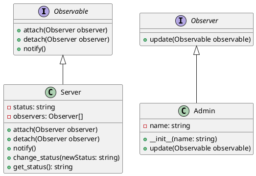

# Python

Мы — команда разработчиков, которая занимается созданием систем мониторинга состояния серверов. Наша задача — обеспечить надежное и своевременное уведомление о состоянии серверов, чтобы администраторы могли оперативно реагировать на любые изменения.

### Описание кейса

В этом кейсе мы рассмотрим, как применить паттерн "Наблюдатель" (Observer) для мониторинга состояния серверов. Паттерн "Наблюдатель" позволяет объектам (наблюдателям) получать уведомления о событиях, происходящих в других объектах (наблюдаемых). В нашем случае сервер будет наблюдаемым объектом, а администраторы — наблюдателями.

### Применение паттерна

Паттерн "Наблюдатель" поможет нам реализовать систему, в которой серверы будут уведомлять администраторов о своем состоянии. Это позволит администраторам своевременно реагировать на любые изменения, такие как перегрузка, отказ оборудования и т.д.

### Пример кода на Python

**1. Определение интерфейсов**


```python
from abc import ABC, abstractmethod

# Интерфейс для наблюдаемых объектов (серверов)
class Observable(ABC):
    @abstractmethod
    def attach(self, observer):
        pass

    @abstractmethod
    def detach(self, observer):
        pass

    @abstractmethod
    def notify(self):
        pass

# Интерфейс для наблюдателей (администраторов)
class Observer(ABC):
    @abstractmethod
    def update(self, observable):
        pass
```


**2. Реализация наблюдаемого объекта (сервера)**


```python
class Server(Observable):
    def __init__(self):
        self.status = ""
        self.observers = []

    def attach(self, observer):
        self.observers.append(observer)

    def detach(self, observer):
        self.observers.remove(observer)

    def notify(self):
        for observer in self.observers:
            observer.update(self)

    def change_status(self, new_status):
        self.status = new_status
        self.notify()

    def get_status(self):
        return self.status
```


**3. Реализация наблюдателя (администратора)**


```python
class Admin(Observer):
    def __init__(self, name):
        self.name = name

    def update(self, observable):
        print(f"Администратор {self.name} получил уведомление: состояние сервера изменилось на {observable.get_status()}")
```


#### Пример использования


```python
if __name__ == "__main__":
    # Создаем сервер
    server = Server()

    # Создаем администраторов
    admin1 = Admin("Админ 1")
    admin2 = Admin("Админ 2")

    # Подписываем администраторов на уведомления от сервера
    server.attach(admin1)
    server.attach(admin2)

    # Изменяем состояние сервера
    server.change_status("Перегрузка")

    # Отписываем одного администратора
    server.detach(admin1)

    # Изменяем состояние сервера еще раз
    server.change_status("Нормально")
```


### UML диаграмма

<figure><figcaption><p>UML диаграмма для паттерна "Наблюдатель"</p></figcaption></figure>





### Вывод для кейса

Паттерн "Наблюдатель" позволяет нам создать гибкую систему мониторинга состояния серверов. Администраторы могут подписываться на уведомления от серверов и своевременно получать информацию о любых изменениях. Это помогает оперативно реагировать на проблемы и поддерживать стабильную работу серверов.
