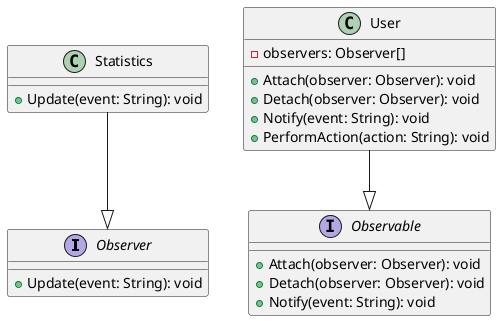

# Go

Мы — команда разработчиков, которая работает над веб-приложением для анализа статистики пользователей. Наше приложение собирает данные о действиях пользователей и обновляет статистику в реальном времени. Для этого мы используем паттерн проектирования "Наблюдатель" (Observer). Этот паттерн позволяет объектам подписываться на события и получать уведомления, когда эти события происходят.

### Описание кейса

В нашем приложении есть несколько компонентов, которые должны обновляться, когда пользователь выполняет определенные действия, такие как вход в систему, выход из системы или выполнение каких-либо действий. Мы хотим, чтобы статистика обновлялась автоматически и в реальном времени. Для этого мы будем использовать паттерн "Наблюдатель".

### Применение паттерна

Паттерн "Наблюдатель" позволяет объектам подписываться на события и получать уведомления, когда эти события происходят. В нашем случае, когда пользователь выполняет действие, мы будем уведомлять всех подписчиков (наблюдателей) об этом событии, чтобы они могли обновить статистику.

### Пример кода на Go

**Интерфейсы и классы**


```go
package main

import "fmt"

// Интерфейс наблюдателя
type Observer interface {
    Update(event string)
}

// Интерфейс наблюдаемого объекта
type Observable interface {
    Attach(observer Observer)
    Detach(observer Observer)
    Notify(event string)
}

// Класс пользователя, который является наблюдаемым объектом
type User struct {
    observers []Observer
}

func (u *User) Attach(observer Observer) {
    u.observers = append(u.observers, observer)
}

func (u *User) Detach(observer Observer) {
    var newObservers []Observer
    for _, obs := range u.observers {
        if obs != observer {
            newObservers = append(newObservers, obs)
        }
    }
    u.observers = newObservers
}

func (u *User) Notify(event string) {
    for _, observer := range u.observers {
        observer.Update(event)
    }
}

// Метод, который вызывается при выполнении действия пользователем
func (u *User) PerformAction(action string) {
    // Выполнение действия...
    u.Notify(action)
}

// Класс статистики, который является наблюдателем
type Statistics struct{}

func (s *Statistics) Update(event string) {
    fmt.Printf("Статистика обновлена: событие '%s' произошло.\n", event)
}
```


**Пример использования**


```go
func main() {
    // Создаем пользователя
    user := &User{}

    // Создаем статистику и подписываем ее на события пользователя
    statistics := &Statistics{}
    user.Attach(statistics)

    // Пользователь выполняет действие
    user.PerformAction("вход в систему")
    user.PerformAction("выход из системы")
}
```


### UML диаграмма

<figure><figcaption><p>UML диаграмма для паттерна "Наблюдатель"</p></figcaption></figure>





### Вывод для кейса

Использование паттерна "Наблюдатель" позволяет нам легко и эффективно обновлять статистику в реальном времени. Когда пользователь выполняет действие, все подписчики (наблюдатели) получают уведомление и могут обновить статистику. Это делает наше приложение более гибким и удобным в использовании.
