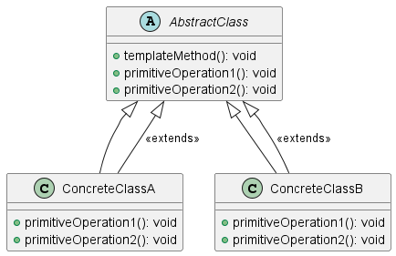

# PHP

Мы — команда разработчиков, которая работает над веб-приложением для анализа статистики пользователей. Наше приложение собирает данные о действиях пользователей и обновляет статистику в реальном времени. Для этого мы используем паттерн проектирования "Наблюдатель" (Observer). Этот паттерн позволяет объектам подписываться на события и получать уведомления, когда эти события происходят.

### Описание кейса

В нашем приложении есть несколько компонентов, которые должны обновляться, когда пользователь выполняет определенные действия, такие как вход в систему, выход из системы или выполнение каких-либо действий. Мы хотим, чтобы статистика обновлялась автоматически и в реальном времени. Для этого мы будем использовать паттерн "Наблюдатель".

### Применение паттерна

Паттерн "Наблюдатель" позволяет объектам подписываться на события и получать уведомления, когда эти события происходят. В нашем случае, когда пользователь выполняет действие, мы будем уведомлять всех подписчиков (наблюдателей) об этом событии, чтобы они могли обновить статистику.

### Пример кода на PHP

**Интерфейсы и классы**


```php
// Интерфейс наблюдателя
interface Observer {
    public function update(string $event);
}

// Интерфейс наблюдаемого объекта
interface Observable {
    public function attach(Observer $observer);
    public function detach(Observer $observer);
    public function notify(string $event);
}

// Класс пользователя, который является наблюдаемым объектом
class User implements Observable {
    private $observers = [];

    public function attach(Observer $observer) {
        $this->observers[] = $observer;
    }

    public function detach(Observer $observer) {
        $this->observers = array_filter($this->observers, function($obs) use ($observer) {
            return $obs !== $observer;
        });
    }

    public function notify(string $event) {
        foreach ($this->observers as $observer) {
            $observer->update($event);
        }
    }

    // Метод, который вызывается при выполнении действия пользователем
    public function performAction(string $action) {
        // Выполнение действия...
        $this->notify($action);
    }
}

// Класс статистики, который является наблюдателем
class Statistics implements Observer {
    public function update(string $event) {
        echo "Статистика обновлена: событие '$event' произошло.\n";
    }
}
```


**Пример использования**


```php
// Создаем пользователя
$user = new User();

// Создаем статистику и подписываем ее на события пользователя
$statistics = new Statistics();
$user->attach($statistics);

// Пользователь выполняет действие
$user->performAction('вход в систему');
$user->performAction('выход из системы');
```


### UML диаграмма

<figure><figcaption><p>UML диаграмма для паттерна "Наблюдатель"</p></figcaption></figure>





### Вывод для кейса

Использование паттерна "Наблюдатель" позволяет нам легко и эффективно обновлять статистику в реальном времени. Когда пользователь выполняет действие, все подписчики (наблюдатели) получают уведомление и могут обновить статистику. Это делает наше приложение более гибким и удобным в использовании.
