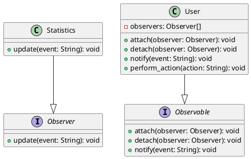

# Python

Мы — команда разработчиков, которая работает над веб-приложением для анализа статистики пользователей. Наше приложение собирает данные о действиях пользователей и обновляет статистику в реальном времени. Для этого мы используем паттерн проектирования "Наблюдатель" (Observer). Этот паттерн позволяет объектам подписываться на события и получать уведомления, когда эти события происходят.

### Описание кейса

В нашем приложении есть несколько компонентов, которые должны обновляться, когда пользователь выполняет определенные действия, такие как вход в систему, выход из системы или выполнение каких-либо действий. Мы хотим, чтобы статистика обновлялась автоматически и в реальном времени. Для этого мы будем использовать паттерн "Наблюдатель".

### Применение паттерна

Паттерн "Наблюдатель" позволяет объектам подписываться на события и получать уведомления, когда эти события происходят. В нашем случае, когда пользователь выполняет действие, мы будем уведомлять всех подписчиков (наблюдателей) об этом событии, чтобы они могли обновить статистику.

### Пример кода на Python

**Интерфейсы и классы**


```python
from abc import ABC, abstractmethod

# Интерфейс наблюдателя
class Observer(ABC):
    @abstractmethod
    def update(self, event: str):
        pass

# Интерфейс наблюдаемого объекта
class Observable(ABC):
    @abstractmethod
    def attach(self, observer: Observer):
        pass

    @abstractmethod
    def detach(self, observer: Observer):
        pass

    @abstractmethod
    def notify(self, event: str):
        pass

# Класс пользователя, который является наблюдаемым объектом
class User(Observable):
    def __init__(self):
        self.observers = []

    def attach(self, observer: Observer):
        self.observers.append(observer)

    def detach(self, observer: Observer):
        self.observers = [obs for obs in self.observers if obs != observer]

    def notify(self, event: str):
        for observer in self.observers:
            observer.update(event)

    # Метод, который вызывается при выполнении действия пользователем
    def perform_action(self, action: str):
        # Выполнение действия...
        self.notify(action)

# Класс статистики, который является наблюдателем
class Statistics(Observer):
    def update(self, event: str):
        print(f"Статистика обновлена: событие '{event}' произошло.")
```


**Пример использования**


```python
if __name__ == "__main__":
    # Создаем пользователя
    user = User()

    # Создаем статистику и подписываем ее на события пользователя
    statistics = Statistics()
    user.attach(statistics)

    # Пользователь выполняет действие
    user.perform_action("вход в систему")
    user.perform_action("выход из системы")
```


### UML диаграмма

<figure><figcaption><p>UML диаграмма для паттерна "Наблюдатель"</p></figcaption></figure>





### Вывод для кейса

Использование паттерна "Наблюдатель" позволяет нам легко и эффективно обновлять статистику в реальном времени. Когда пользователь выполняет действие, все подписчики (наблюдатели) получают уведомление и могут обновить статистику. Это делает наше приложение более гибким и удобным в использовании.
