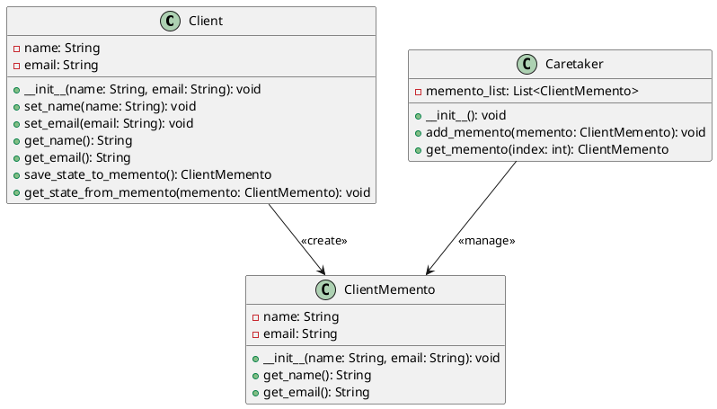

# Python

Мы — команда разработчиков, работающая над системой управления взаимоотношениями с клиентами (CRM). Наша задача — сделать работу с клиентами максимально удобной и эффективной. В этом кейсе мы рассмотрим, как применить паттерн "Мнемонико" (Memento) для реализации функции отмены действий в нашей CRM-системе. Это позволит пользователям отменять свои действия, такие как изменение данных клиента или создание новой записи, и возвращаться к предыдущему состоянию.

### Описание кейса

В нашей CRM-системе пользователи часто вносят изменения в данные клиентов. Иногда эти изменения могут быть ошибочными, и пользователи хотят вернуться к предыдущему состоянию. Паттерн "Мнемонико" позволяет сохранять состояние объекта и восстанавливать его позже без нарушения инкапсуляции.

### Применение паттерна

Мы будем использовать паттерн "Мнемонико" для сохранения состояния объекта "Клиент" перед внесением изменений. Если пользователь захочет отменить изменения, мы сможем восстановить предыдущее состояние объекта.

#### Пример кода на Python

**Класс Client (Клиент)**


```python
class Client:
    def __init__(self, name, email):
        self.name = name
        self.email = email

    def set_name(self, name):
        self.name = name

    def set_email(self, email):
        self.email = email

    def get_name(self):
        return self.name

    def get_email(self):
        return self.email

    def save_state_to_memento(self):
        return ClientMemento(self.name, self.email)

    def get_state_from_memento(self, memento):
        self.name = memento.get_name()
        self.email = memento.get_email()
```


**Класс ClientMemento (Мнемонико Клиента)**


```python
class ClientMemento:
    def __init__(self, name, email):
        self.name = name
        self.email = email

    def get_name(self):
        return self.name

    def get_email(self):
        return self.email
```


**Класс Caretaker (Опекун)**


```python
class Caretaker:
    def __init__(self):
        self.memento_list = []

    def add_memento(self, memento):
        self.memento_list.append(memento)

    def get_memento(self, index):
        return self.memento_list[index]
```


#### Пример использования


```python
if __name__ == "__main__":
    # Создаем объект клиента
    client = Client("Иван Иванов", "ivan@example.com")

    # Создаем объект опекуна
    caretaker = Caretaker()

    # Сохраняем текущее состояние клиента
    caretaker.add_memento(client.save_state_to_memento())

    # Изменяем данные клиента
    client.set_name("Петр Петров")
    client.set_email("petr@example.com")

    # Сохраняем новое состояние клиента
    caretaker.add_memento(client.save_state_to_memento())

    # Восстанавливаем предыдущее состояние клиента
    client.get_state_from_memento(caretaker.get_memento(0))

    # Выводим данные клиента
    print("Имя:", client.get_name())
    print("Email:", client.get_email())
```


#### UML диаграмма

<figure><figcaption><p>UML диаграмма для паттерна "Мнемонико"</p></figcaption></figure>





### Вывод для кейса

Паттерн "Мнемонико" позволяет нам эффективно управлять состоянием объектов в нашей CRM-системе. Мы можем сохранять состояние объекта перед внесением изменений и восстанавливать его позже, если это необходимо. Это делает нашу систему более гибкой и удобной для пользователей, позволяя им отменять свои действия и возвращаться к предыдущему состоянию.

Надеюсь, этот кейс поможет вам лучше понять, как применять паттерн "Мнемонико" в реальных проектах.
