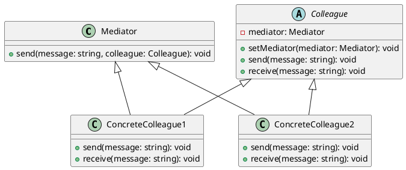

# Посредник (Mediator)

### **Описание**

Паттерн "Посредник" (Mediator) определяет объект, который инкапсулирует взаимодействие между набором объектов. Посредник обеспечивает слабую связанность, позволяя объектам взаимодействовать друг с другом без прямой зависимости. Это упрощает управление взаимодействиями и позволяет изменять их независимо от самих объектов.

### **UML диаграмма**

<figure><figcaption>
UML диаграмма для паттерна "Посредник"
</figcaption></figure>





**Поля**

* `mediator: Mediator`: Ссылка на объект посредника, который управляет взаимодействием между коллегами.

**Методы**

* `send(message: string, colleague: Colleague): void`: Метод для отправки сообщения от одного коллеги другому через посредника.
* `setMediator(mediator: Mediator): void`: Метод для установки посредника для коллеги.
* `send(message: string): void`: Метод для отправки сообщения через посредника.
* `receive(message: string): void`: Метод для получения сообщения от посредника.

**Mediator (Посредник):**

* **Описание**: Объект, который инкапсулирует взаимодействие между набором объектов.
* **Методы**:
  * `send(message: string, colleague: Colleague): void`: Метод для отправки сообщения от одного коллеги другому.

**Colleague (Коллега):**

* **Описание**: Базовый класс для всех коллег, которые взаимодействуют через посредника.
* **Методы**:
  * `setMediator(mediator: Mediator): void`: Метод для установки посредника для коллеги.
  * `send(message: string): void`: Метод для отправки сообщения через посредника.
  * `receive(message: string): void`: Метод для получения сообщения от посредника.

**ConcreteColleague1 (Конкретный коллега 1):**

* **Описание**: Класс, реализующий методы для взаимодействия через посредника.
* **Методы**:
  * `send(message: string): void`: Реализация метода для отправки сообщения через посредника.
  * `receive(message: string): void`: Реализация метода для получения сообщения от посредника.

**ConcreteColleague2 (Конкретный коллега 2):**

* **Описание**: Класс, реализующий методы для взаимодействия через посредника.
* **Методы**:
  * `send(message: string): void`: Реализация метода для отправки сообщения через посредника.
  * `receive(message: string): void`: Реализация метода для получения сообщения от посредника.

### **Преимущества паттерна "Посредник"**

* **Слабая связанность**: Объекты взаимодействуют друг с другом через посредника, что уменьшает их взаимную зависимость.
* **Упрощение взаимодействий**: Посредник управляет взаимодействиями между объектами, что упрощает их управление.
* **Гибкость**: Легко изменять взаимодействия между объектами без изменения самих объектов.

### **Недостатки паттерна "Посредник"**

* **Сложность**: Введение посредника может усложнить код.
* **Производительность**: Дополнительные вызовы методов через посредника могут негативно сказаться на производительности.

### **Применение паттерна "Посредник"**

* **Управление диалогами**: Когда нужно управлять сложными диалогами между объектами.
* **Системы управления**: Когда нужно управлять взаимодействиями между компонентами системы.
* **Системы сообщений**: Когда нужно управлять отправкой и получением сообщений между объектами.

### **Примеры использования паттерна "Посредник"**

* **Системы управления пользовательскими интерфейсами**: В системах управления пользовательскими интерфейсами, где нужно управлять взаимодействиями между различными элементами интерфейса.
* **Системы управления сетями**: В системах управления сетями, где нужно управлять взаимодействиями между узлами сети.
* **Системы управления событиями**: В системах управления событиями, где нужно управлять взаимодействиями между различными источниками и получателями событий.

Паттерн "Посредник" является мощным инструментом для управления взаимодействиями между объектами. Он широко используется в различных областях, таких как системы управления пользовательскими интерфейсами, системы управления сетями и системы управления событиями.
