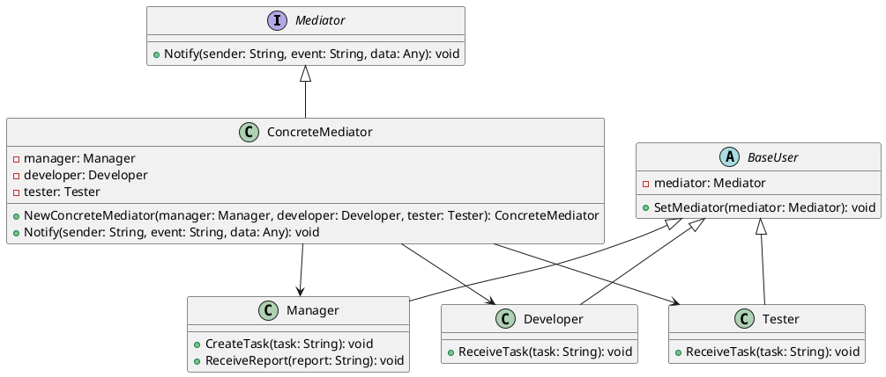

# Go

Мы — команда разработчиков, создающих систему управления проектами. Наша цель — сделать так, чтобы все участники проекта могли легко и эффективно взаимодействовать друг с другом. Для этого мы используем паттерн проектирования "Посредник" (Mediator). Этот паттерн помогает уменьшить зависимости между объектами, позволяя им общаться через посредника, а не напрямую.

### Описание кейса

В нашей системе управления проектами есть несколько типов пользователей: менеджеры, разработчики и тестировщики. Каждый из них выполняет свои задачи и должен быть в курсе того, что делают другие. Например, менеджер создает задачи, разработчик их выполняет, а тестировщик проверяет. Без посредника все они должны были бы напрямую общаться друг с другом, что привело бы к сложной и запутанной системе.

### Применение паттерна "Посредник"

Паттерн "Посредник" позволяет нам создать центральный объект, который будет координировать взаимодействие между всеми участниками. Это упрощает коммуникацию и делает систему более гибкой и легкой в поддержке.

### Пример кода на Go

**1. Интерфейс Посредника**


```go
package main

type Mediator interface {
    Notify(sender string, event string, data interface{})
}
```


**2. Конкретный Посредник**


```go
package main

type ConcreteMediator struct {
    manager  *Manager
    developer *Developer
    tester   *Tester
}

func NewConcreteMediator(manager *Manager, developer *Developer, tester *Tester) *ConcreteMediator {
    mediator := &ConcreteMediator{
        manager:  manager,
        developer: developer,
        tester:   tester,
    }
    manager.SetMediator(mediator)
    developer.SetMediator(mediator)
    tester.SetMediator(mediator)
    return mediator
}

func (m *ConcreteMediator) Notify(sender string, event string, data interface{}) {
    if sender == "Manager" {
        if event == "TaskCreated" {
            m.developer.ReceiveTask(data)
        }
    } else if sender == "Developer" {
        if event == "TaskCompleted" {
            m.tester.ReceiveTask(data)
        }
    } else if sender == "Tester" {
        if event == "TaskTested" {
            m.manager.ReceiveReport(data)
        }
    }
}
```


**3. Базовый класс участника**


```go
package main

type BaseUser struct {
    mediator Mediator
}

func (u *BaseUser) SetMediator(mediator Mediator) {
    u.mediator = mediator
}
```


**4. Класс Менеджера**


```go
package main

import "fmt"

type Manager struct {
    BaseUser
}

func (m *Manager) CreateTask(task string) {
    // Логика создания задачи
    m.mediator.Notify("Manager", "TaskCreated", task)
}

func (m *Manager) ReceiveReport(report string) {
    // Логика получения отчета
    fmt.Printf("Manager received report: %s\n", report)
}
```


**5. Класс Разработчика**


```go
package main

import "fmt"

type Developer struct {
    BaseUser
}

func (d *Developer) ReceiveTask(task string) {
    // Логика получения задачи
    fmt.Printf("Developer received task: %s\n", task)
    // Выполнение задачи
    d.mediator.Notify("Developer", "TaskCompleted", task)
}
```


**6. Класс Тестировщика**


```go
package main

import "fmt"

type Tester struct {
    BaseUser
}

func (t *Tester) ReceiveTask(task string) {
    // Логика получения задачи
    fmt.Printf("Tester received task: %s\n", task)
    // Тестирование задачи
    report := fmt.Sprintf("Test report for task: %s", task)
    t.mediator.Notify("Tester", "TaskTested", report)
}
```


### Пример использования


```go
package main

func main() {
    manager := &Manager{}
    developer := &Developer{}
    tester := &Tester{}

    mediator := NewConcreteMediator(manager, developer, tester)

    manager.CreateTask("Task 1")
}
```


### UML диаграмма

<figure><figcaption><p>UML диаграмма для паттерна "Посредник"</p></figcaption></figure>





### Вывод для кейса

Использование паттерна "Посредник" в нашей системе управления проектами позволяет значительно упростить взаимодействие между различными участниками проекта. Вместо того чтобы каждый участник общался напрямую с другими, все взаимодействия проходят через центральный объект — посредника. Это делает систему более гибкой, легкой в поддержке и расширении. Менеджеры, разработчики и тестировщики могут сосредоточиться на своих задачах, не беспокоясь о том, как именно они будут взаимодействовать друг с другом.
