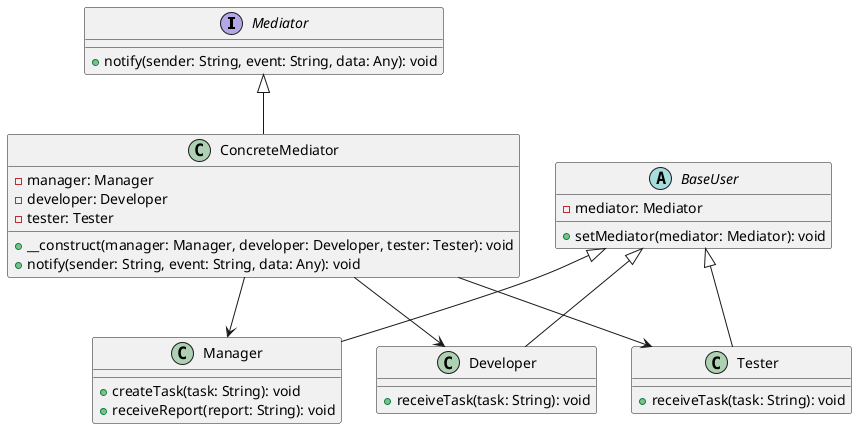

# PHP

Мы — команда разработчиков, создающих систему управления проектами. Наша цель — сделать так, чтобы все участники проекта могли легко и эффективно взаимодействовать друг с другом. Для этого мы используем паттерн проектирования "Посредник" (Mediator). Этот паттерн помогает уменьшить зависимости между объектами, позволяя им общаться через посредника, а не напрямую.

### Описание кейса

В нашей системе управления проектами есть несколько типов пользователей: менеджеры, разработчики и тестировщики. Каждый из них выполняет свои задачи и должен быть в курсе того, что делают другие. Например, менеджер создает задачи, разработчик их выполняет, а тестировщик проверяет. Без посредника все они должны были бы напрямую общаться друг с другом, что привело бы к сложной и запутанной системе.

### Применение паттерна "Посредник"

Паттерн "Посредник" позволяет нам создать центральный объект, который будет координировать взаимодействие между всеми участниками. Это упрощает коммуникацию и делает систему более гибкой и легкой в поддержке.

### Пример кода на PHP

**1. Интерфейс Посредника**


```php
interface Mediator {
    public function notify(string $sender, string $event, $data = null);
}
```


**2. Конкретный Посредник**


```php
class ConcreteMediator implements Mediator {
    private $manager;
    private $developer;
    private $tester;

    public function __construct(Manager $manager, Developer $developer, Tester $tester) {
        $this->manager = $manager;
        $this->developer = $developer;
        $this->tester = $tester;

        $this->manager->setMediator($this);
        $this->developer->setMediator($this);
        $this->tester->setMediator($this);
    }

    public function notify(string $sender, string $event, $data = null) {
        if ($sender === 'Manager') {
            if ($event === 'TaskCreated') {
                $this->developer->receiveTask($data);
            }
        } elseif ($sender === 'Developer') {
            if ($event === 'TaskCompleted') {
                $this->tester->receiveTask($data);
            }
        } elseif ($sender === 'Tester') {
            if ($event === 'TaskTested') {
                $this->manager->receiveReport($data);
            }
        }
    }
}
```


**3. Базовый класс участника**


```php
abstract class BaseUser {
    protected $mediator;

    public function setMediator(Mediator $mediator) {
        $this->mediator = $mediator;
    }
}
```


**4. Класс Менеджера**


```php
class Manager extends BaseUser {
    public function createTask($task) {
        // Логика создания задачи
        $this->mediator->notify('Manager', 'TaskCreated', $task);
    }

    public function receiveReport($report) {
        // Логика получения отчета
        echo "Manager received report: $report\n";
    }
}
```


**5. Класс Разработчика**


```php
class Developer extends BaseUser {
    public function receiveTask($task) {
        // Логика получения задачи
        echo "Developer received task: $task\n";
        // Выполнение задачи
        $this->mediator->notify('Developer', 'TaskCompleted', $task);
    }
}
```


**6. Класс Тестировщика**


```php
class Tester extends BaseUser {
    public function receiveTask($task) {
        // Логика получения задачи
        echo "Tester received task: $task\n";
        // Тестирование задачи
        $report = "Test report for task: $task";
        $this->mediator->notify('Tester', 'TaskTested', $report);
    }
}
```


#### Пример использования


```php
$manager = new Manager();
$developer = new Developer();
$tester = new Tester();

$mediator = new ConcreteMediator($manager, $developer, $tester);

$manager->createTask('Task 1');
```


### UML диаграмма

<figure><figcaption><p>UML диаграмма для паттерна "Посредник"</p></figcaption></figure>





### Вывод для кейса

Использование паттерна "Посредник" в нашей системе управления проектами позволяет значительно упростить взаимодействие между различными участниками проекта. Вместо того чтобы каждый участник общался напрямую с другими, все взаимодействия проходят через центральный объект — посредника. Это делает систему более гибкой, легкой в поддержке и расширении. Менеджеры, разработчики и тестировщики могут сосредоточиться на своих задачах, не беспокоясь о том, как именно они будут взаимодействовать друг с другом
