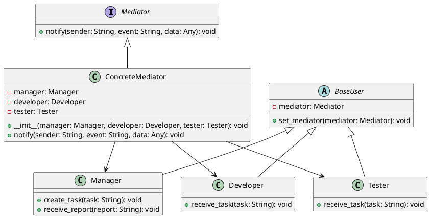

# Python

Мы — команда разработчиков, создающих систему управления проектами. Наша цель — сделать так, чтобы все участники проекта могли легко и эффективно взаимодействовать друг с другом. Для этого мы используем паттерн проектирования "Посредник" (Mediator). Этот паттерн помогает уменьшить зависимости между объектами, позволяя им общаться через посредника, а не напрямую.

### Описание кейса

В нашей системе управления проектами есть несколько типов пользователей: менеджеры, разработчики и тестировщики. Каждый из них выполняет свои задачи и должен быть в курсе того, что делают другие. Например, менеджер создает задачи, разработчик их выполняет, а тестировщик проверяет. Без посредника все они должны были бы напрямую общаться друг с другом, что привело бы к сложной и запутанной системе.

### Применение паттерна "Посредник"

Паттерн "Посредник" позволяет нам создать центральный объект, который будет координировать взаимодействие между всеми участниками. Это упрощает коммуникацию и делает систему более гибкой и легкой в поддержке.

### Пример кода на Python

**1. Интерфейс Посредника**


```python
from abc import ABC, abstractmethod

class Mediator(ABC):
    @abstractmethod
    def notify(self, sender: str, event: str, data=None):
        pass
```


**2. Конкретный Посредник**


```python
class ConcreteMediator(Mediator):
    def __init__(self, manager, developer, tester):
        self.manager = manager
        self.developer = developer
        self.tester = tester
        self.manager.set_mediator(self)
        self.developer.set_mediator(self)
        self.tester.set_mediator(self)

    def notify(self, sender: str, event: str, data=None):
        if sender == 'Manager':
            if event == 'TaskCreated':
                self.developer.receive_task(data)
        elif sender == 'Developer':
            if event == 'TaskCompleted':
                self.tester.receive_task(data)
        elif sender == 'Tester':
            if event == 'TaskTested':
                self.manager.receive_report(data)
```


**3. Базовый класс участника**


```python
class BaseUser:
    def __init__(self):
        self.mediator = None

    def set_mediator(self, mediator: Mediator):
        self.mediator = mediator
```


**4. Класс Менеджера**


```python
class Manager(BaseUser):
    def create_task(self, task: str):
        # Логика создания задачи
        self.mediator.notify('Manager', 'TaskCreated', task)

    def receive_report(self, report: str):
        # Логика получения отчета
        print(f"Manager received report: {report}")
```


**5. Класс Разработчика**


```python
class Developer(BaseUser):
    def receive_task(self, task: str):
        # Логика получения задачи
        print(f"Developer received task: {task}")
        # Выполнение задачи
        self.mediator.notify('Developer', 'TaskCompleted', task)
```


**6. Класс Тестировщика**


```python
class Tester(BaseUser):
    def receive_task(self, task: str):
        # Логика получения задачи
        print(f"Tester received task: {task}")
        # Тестирование задачи
        report = f"Test report for task: {task}"
        self.mediator.notify('Tester', 'TaskTested', report)
```


#### Пример использования


```python
if __name__ == "__main__":
    manager = Manager()
    developer = Developer()
    tester = Tester()

    mediator = ConcreteMediator(manager, developer, tester)

    manager.create_task('Task 1')
```


### UML диаграмма

<figure><figcaption><p>UML диаграмма для паттерна "Посредник"</p></figcaption></figure>





### Вывод для кейса

Использование паттерна "Посредник" в нашей системе управления проектами позволяет значительно упростить взаимодействие между различными участниками проекта. Вместо того чтобы каждый участник общался напрямую с другими, все взаимодействия проходят через центральный объект — посредника. Это делает систему более гибкой, легкой в поддержке и расширении. Менеджеры, разработчики и тестировщики могут сосредоточиться
