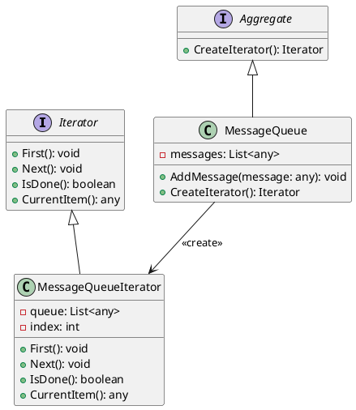

# Go

Мы — команда разработчиков, работающая над веб-приложением для управления очередями сообщений. Наша задача — обработать все сообщения в очереди и выполнить определенные действия для каждого сообщения. Для этого мы будем использовать паттерн "Итератор", который позволит нам последовательно обрабатывать элементы очереди, не заботясь о её внутренней структуре.

### Описание кейса

Мы хотим создать систему, которая будет обрабатывать сообщения из очереди. Каждое сообщение может содержать различные данные, и нам нужно выполнить определенные действия для каждого сообщения. Паттерн "Итератор" поможет нам абстрагироваться от внутренней структуры очереди и сосредоточиться на обработке сообщений.

### Пример кода на Go

**1. Определение интерфейса Iterator**


```go
package main

import "fmt"

type Iterator interface {
    First()
    Next()
    IsDone() bool
    CurrentItem() interface{}
}
```


**2. Определение интерфейса Aggregate**


```go
type Aggregate interface {
    CreateIterator() Iterator
}
```


**3. Реализация конкретного итератора**


```go
type MessageQueueIterator struct {
    queue  []interface{}
    index  int
}

func (i *MessageQueueIterator) First() {
    i.index = 0
}

func (i *MessageQueueIterator) Next() {
    i.index++
}

func (i *MessageQueueIterator) IsDone() bool {
    return i.index >= len(i.queue)
}

func (i *MessageQueueIterator) CurrentItem() interface{} {
    if i.IsDone() {
        return nil
    }
    return i.queue[i.index]
}
```


**4. Реализация конкретного агрегата**


```go
type MessageQueue struct {
    messages []interface{}
}

func (q *MessageQueue) AddMessage(message interface{}) {
    q.messages = append(q.messages, message)
}

func (q *MessageQueue) CreateIterator() Iterator {
    return &MessageQueueIterator{queue: q.messages}
}
```


**5. Использование итератора для обработки сообщений**


```go
func main() {
    // Создаем очередь сообщений
    messageQueue := &MessageQueue{}
    messageQueue.AddMessage("Сообщение 1")
    messageQueue.AddMessage("Сообщение 2")
    messageQueue.AddMessage("Сообщение 3")

    // Создаем итератор для очереди
    iterator := messageQueue.CreateIterator()

    // Обрабатываем сообщения
    for iterator.First(); !iterator.IsDone(); iterator.Next() {
        message := iterator.CurrentItem()
        fmt.Printf("Обработка сообщения: %v\n", message)
    }
}
```


### UML диаграмма

<figure><figcaption><p>UML диаграмма для паттерна "Итератор"</p></figcaption></figure>





### Вывод

В этом кейсе мы рассмотрели применение паттерна "Итератор" для обработки сообщений в очереди. Мы создали интерфейсы `Iterator` и `Aggregate`, а также их конкретные реализации `MessageQueueIterator` и `MessageQueue`. Это позволило нам абстрагироваться от внутренней структуры очереди и сосредоточиться на обработке сообщений.

Паттерн "Итератор" оказался очень полезным для последовательной обработки элементов коллекции, не заботясь о её внутренней структуре. Это упрощает код и делает его более гибким и поддерживаемым.

Надеюсь, этот пример поможет вам лучше понять, как использовать паттерн "Итератор" в ваших проектах!
