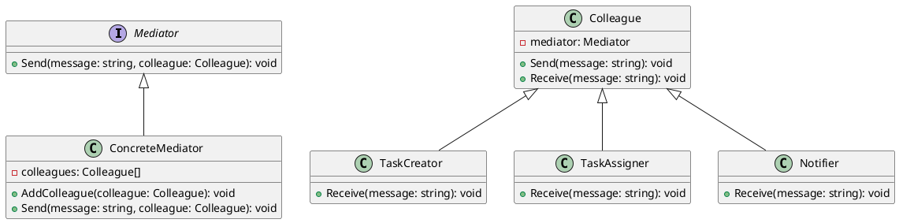

# Go

Мы — команда разработчиков, работающая над созданием таск-трекера. Наш продукт помогает командам эффективно управлять задачами, распределять их между участниками и отслеживать прогресс. В этом кейсе мы рассмотрим, как паттерн "Посредник" (Mediator) помогает нам управлять взаимодействиями между различными компонентами нашего таск-трекера.

### Описание кейса

В нашем таск-трекере есть несколько компонентов, такие как создание задач, назначение задач, отслеживание прогресса и уведомления. Эти компоненты должны взаимодействовать друг с другом, чтобы обеспечить плавную работу системы. Паттерн "Посредник" позволяет нам централизовать управление этими взаимодействиями, что упрощает код и делает его более гибким.

### Применение паттерна

Паттерн "Посредник" используется для централизованного управления взаимодействиями между компонентами. В нашем случае, посредник будет координировать действия между компонентами, такими как создание задач, назначение задач и уведомления. Это позволит нам избежать прямой зависимости между компонентами и упростить управление их взаимодействиями.

### Пример кода на Go

**1. Определение интерфейса посредника**


```go
package main

import "fmt"

type Mediator interface {
    Send(message string, colleague Colleague)
}
```


**2. Определение базового класса коллеги**


```go
type Colleague struct {
    mediator Mediator
}

func (c *Colleague) Send(message string) {
    c.mediator.Send(message, c)
}

func (c *Colleague) Receive(message string) {
    // Метод для получения сообщения
}
```


**3. Определение конкретного посредника**


```go
type ConcreteMediator struct {
    colleagues []Colleague
}

func (m *ConcreteMediator) AddColleague(colleague Colleague) {
    m.colleagues = append(m.colleagues, colleague)
}

func (m *ConcreteMediator) Send(message string, colleague Colleague) {
    for _, col := range m.colleagues {
        if &col != &colleague {
            col.Receive(message)
        }
    }
}
```


**4. Определение конкретных коллег**


```go
type TaskCreator struct {
    Colleague
}

func (tc *TaskCreator) Receive(message string) {
    fmt.Println("TaskCreator получил сообщение:", message)
}

type TaskAssigner struct {
    Colleague
}

func (ta *TaskAssigner) Receive(message string) {
    fmt.Println("TaskAssigner получил сообщение:", message)
}

type Notifier struct {
    Colleague
}

func (n *Notifier) Receive(message string) {
    fmt.Println("Notifier получил сообщение:", message)
}
```


**5. Пример использования**


```go
func main() {
    // Создаем посредника
    mediator := &ConcreteMediator{}

    // Создаем коллег
    taskCreator := &TaskCreator{Colleague: Colleague{mediator: mediator}}
    taskAssigner := &TaskAssigner{Colleague: Colleague{mediator: mediator}}
    notifier := &Notifier{Colleague: Colleague{mediator: mediator}}

    // Добавляем коллег в посредника
    mediator.AddColleague(taskCreator.Colleague)
    mediator.AddColleague(taskAssigner.Colleague)
    mediator.AddColleague(notifier.Colleague)

    // Отправляем сообщение от TaskCreator
    taskCreator.Send("Новая задача создана")

    // Отправляем сообщение от TaskAssigner
    taskAssigner.Send("Задача назначена пользователю")

    // Отправляем сообщение от Notifier
    notifier.Send("Уведомление отправлено")
}
```


### UML диаграмма

<figure><figcaption><p>UML диаграмма для паттерна "Посредник"</p></figcaption></figure>





### Вывод для кейса

Паттерн "Посредник" позволяет нам централизовать управление взаимодействиями между компонентами таск-трекера. Это упрощает код, делает его более гибким и облегчает добавление новых компонентов в систему. В нашем примере посредник координирует действия между созданием задач, назначением задач и уведомлениями, что позволяет избежать прямой зависимости между этими компонентами.

Надеюсь, этот кейс поможет вам лучше понять, как использовать паттерн "Посредник" в реальных проектах.
