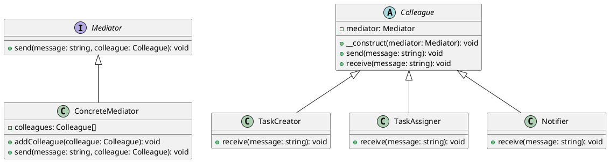

# PHP

Мы — команда разработчиков, работающая над созданием таск-трекера. Наш продукт помогает командам эффективно управлять задачами, распределять их между участниками и отслеживать прогресс. В этом кейсе мы рассмотрим, как паттерн "Посредник" (Mediator) помогает нам управлять взаимодействиями между различными компонентами нашего таск-трекера.

### Описание кейса

В нашем таск-трекере есть несколько компонентов, такие как создание задач, назначение задач, отслеживание прогресса и уведомления. Эти компоненты должны взаимодействовать друг с другом, чтобы обеспечить плавную работу системы. Паттерн "Посредник" позволяет нам централизовать управление этими взаимодействиями, что упрощает код и делает его более гибким.

### Применение паттерна

Паттерн "Посредник" используется для централизованного управления взаимодействиями между компонентами. В нашем случае, посредник будет координировать действия между компонентами, такими как создание задач, назначение задач и уведомления. Это позволит нам избежать прямой зависимости между компонентами и упростить управление их взаимодействиями.

### Пример кода на PHP

**1. Определение интерфейса посредника**


```php
interface Mediator {
    public function send($message, $colleague);
}
```


**2. Определение базового класса коллеги**


```php
abstract class Colleague {
    protected $mediator;

    public function __construct(Mediator $mediator) {
        $this->mediator = $mediator;
    }

    public function send($message) {
        $this->mediator->send($message, $this);
    }

    public function receive($message) {
        // Метод для получения сообщения
    }
}
```


**3. Определение конкретного посредника**


```php
class ConcreteMediator implements Mediator {
    private $colleagues = [];

    public function addColleague(Colleague $colleague) {
        $this->colleagues[] = $colleague;
    }

    public function send($message, $colleague) {
        foreach ($this->colleagues as $col) {
            if ($col !== $colleague) {
                $col->receive($message);
            }
        }
    }
}
```


**4. Определение конкретных коллег**


```php
class TaskCreator extends Colleague {
    public function receive($message) {
        echo "TaskCreator получил сообщение: $message\n";
    }
}

class TaskAssigner extends Colleague {
    public function receive($message) {
        echo "TaskAssigner получил сообщение: $message\n";
    }
}

class Notifier extends Colleague {
    public function receive($message) {
        echo "Notifier получил сообщение: $message\n";
    }
}
```


**5. Пример использования**


```php
// Создаем посредника
$mediator = new ConcreteMediator();

// Создаем коллег
$taskCreator = new TaskCreator($mediator);
$taskAssigner = new TaskAssigner($mediator);
$notifier = new Notifier($mediator);

// Добавляем коллег в посредника
$mediator->addColleague($taskCreator);
$mediator->addColleague($taskAssigner);
$mediator->addColleague($notifier);

// Отправляем сообщение от TaskCreator
$taskCreator->send("Новая задача создана");

// Отправляем сообщение от TaskAssigner
$taskAssigner->send("Задача назначена пользователю");

// Отправляем сообщение от Notifier
$notifier->send("Уведомление отправлено");
```


### UML диаграмма

<figure><figcaption><p>UML диаграмма для паттерна "Посредник"</p></figcaption></figure>





### Вывод для кейса

Паттерн "Посредник" позволяет нам централизовать управление взаимодействиями между компонентами таск-трекера. Это упрощает код, делает его более гибким и облегчает добавление новых компонентов в систему. В нашем примере посредник координирует действия между созданием задач, назначением задач и уведомлениями, что позволяет избежать прямой зависимости между этими компонентами.

Надеюсь, этот кейс поможет вам лучше понять, как использовать паттерн "Посредник" в реальных проектах.
