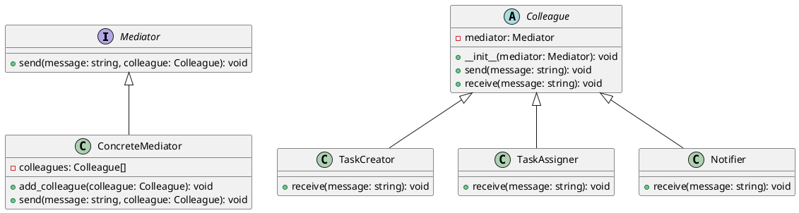

# Python

Мы — команда разработчиков, работающая над созданием таск-трекера. Наш продукт помогает командам эффективно управлять задачами, распределять их между участниками и отслеживать прогресс. В этом кейсе мы рассмотрим, как паттерн "Посредник" (Mediator) помогает нам управлять взаимодействиями между различными компонентами нашего таск-трекера.

### Описание кейса

В нашем таск-трекере есть несколько компонентов, такие как создание задач, назначение задач, отслеживание прогресса и уведомления. Эти компоненты должны взаимодействовать друг с другом, чтобы обеспечить плавную работу системы. Паттерн "Посредник" позволяет нам централизовать управление этими взаимодействиями, что упрощает код и делает его более гибким.

### Применение паттерна

Паттерн "Посредник" используется для централизованного управления взаимодействиями между компонентами. В нашем случае, посредник будет координировать действия между компонентами, такими как создание задач, назначение задач и уведомления. Это позволит нам избежать прямой зависимости между компонентами и упростить управление их взаимодействиями.

#### Пример кода на Python

**1. Определение интерфейса посредника**


```python
from abc import ABC, abstractmethod

class Mediator(ABC):
    @abstractmethod
    def send(self, message, colleague):
        pass
```


**2. Определение базового класса коллеги**


```python
class Colleague(ABC):
    def __init__(self, mediator):
        self.mediator = mediator

    def send(self, message):
        self.mediator.send(message, self)

    @abstractmethod
    def receive(self, message):
        pass
```


**3. Определение конкретного посредника**


```python
class ConcreteMediator(Mediator):
    def __init__(self):
        self.colleagues = []

    def add_colleague(self, colleague):
        self.colleagues.append(colleague)

    def send(self, message, colleague):
        for col in self.colleagues:
            if col != colleague:
                col.receive(message)
```


**4. Определение конкретных коллег**


```python
class TaskCreator(Colleague):
    def receive(self, message):
        print(f"TaskCreator получил сообщение: {message}")

class TaskAssigner(Colleague):
    def receive(self, message):
        print(f"TaskAssigner получил сообщение: {message}")

class Notifier(Colleague):
    def receive(self, message):
        print(f"Notifier получил сообщение: {message}")
```


**5. Пример использования**


```python
if __name__ == "__main__":
    # Создаем посредника
    mediator = ConcreteMediator()

    # Создаем коллег
    task_creator = TaskCreator(mediator)
    task_assigner = TaskAssigner(mediator)
    notifier = Notifier(mediator)

    # Добавляем коллег в посредника
    mediator.add_colleague(task_creator)
    mediator.add_colleague(task_assigner)
    mediator.add_colleague(notifier)

    # Отправляем сообщение от TaskCreator
    task_creator.send("Новая задача создана")

    # Отправляем сообщение от TaskAssigner
    task_assigner.send("Задача назначена пользователю")

    # Отправляем сообщение от Notifier
    notifier.send("Уведомление отправлено")
```


### UML диаграмма

<figure><figcaption><p>UML диаграмма для паттерна "Посредник"</p></figcaption></figure>





### Вывод для кейса

Паттерн "Посредник" позволяет нам централизовать управление взаимодействиями между компонентами таск-трекера. Это упрощает код, делает его более гибким и облегчает добавление новых компонентов в систему. В нашем примере посредник координирует действия между созданием задач, назначением задач и уведомлениями, что позволяет избежать прямой зависимости между этими компонентами.

Надеюсь, этот кейс поможет вам лучше понять, как использовать паттерн "Посредник" в реальных проектах.&#x20;
