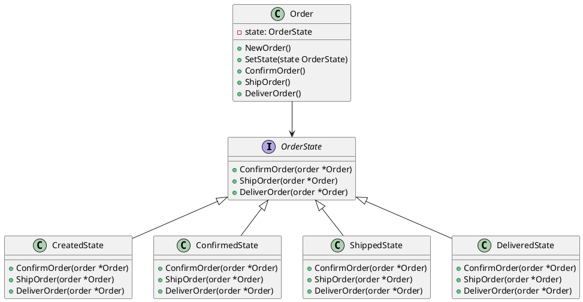

# Go

Мы — департамент разработки в ведущем маркетплейсе РФ. Наша задача — создавать и поддерживать платформу, которая позволяет пользователям легко и удобно совершать покупки. Одной из важных задач является обработка заказов. Заказы проходят через несколько состояний: создание, подтверждение, отправка и доставка. Для управления этими состояниями мы используем паттерн проектирования "Состояние".

### Описание кейса

В нашем маркетплейсе заказ может находиться в одном из следующих состояний:

1. **Создан** — заказ только что создан пользователем.
2. **Подтвержден** — заказ подтвержден продавцом.
3. **Отправлен** — заказ отправлен курьером.
4. **Доставлен** — заказ доставлен пользователю.

Каждое состояние имеет свои действия и ограничения. Например, заказ в состоянии "Создан" не может быть отправлен, пока не будет подтвержден. Паттерн "Состояние" позволяет нам легко управлять этими состояниями и их переходами.

### Применение паттерна

Паттерн "Состояние" позволяет объекту изменять свое поведение в зависимости от его внутреннего состояния. В нашем случае, это позволяет заказу изменять свое поведение в зависимости от текущего состояния (создан, подтвержден, отправлен, доставлен).

### Пример кода на Go

**1. Определение интерфейса состояния**


```go
package main

import "fmt"

type OrderState interface {
    ConfirmOrder(order *Order)
    ShipOrder(order *Order)
    DeliverOrder(order *Order)
}
```


**2. Реализация конкретных состояний**


```go
package main

type CreatedState struct{}

func (s *CreatedState) ConfirmOrder(order *Order) {
    order.SetState(&ConfirmedState{})
    fmt.Println("Заказ подтвержден.")
}

func (s *CreatedState) ShipOrder(order *Order) {
    fmt.Println("Заказ не может быть отправлен, пока не подтвержден.")
}

func (s *CreatedState) DeliverOrder(order *Order) {
    fmt.Println("Заказ не может быть доставлен, пока не отправлен.")
}

type ConfirmedState struct{}

func (s *ConfirmedState) ConfirmOrder(order *Order) {
    fmt.Println("Заказ уже подтвержден.")
}

func (s *ConfirmedState) ShipOrder(order *Order) {
    order.SetState(&ShippedState{})
    fmt.Println("Заказ отправлен.")
}

func (s *ConfirmedState) DeliverOrder(order *Order) {
    fmt.Println("Заказ не может быть доставлен, пока не отправлен.")
}

type ShippedState struct{}

func (s *ShippedState) ConfirmOrder(order *Order) {
    fmt.Println("Заказ уже подтвержден.")
}

func (s *ShippedState) ShipOrder(order *Order) {
    fmt.Println("Заказ уже отправлен.")
}

func (s *ShippedState) DeliverOrder(order *Order) {
    order.SetState(&DeliveredState{})
    fmt.Println("Заказ доставлен.")
}

type DeliveredState struct{}

func (s *DeliveredState) ConfirmOrder(order *Order) {
    fmt.Println("Заказ уже подтвержден.")
}

func (s *DeliveredState) ShipOrder(order *Order) {
    fmt.Println("Заказ уже отправлен.")
}

func (s *DeliveredState) DeliverOrder(order *Order) {
    fmt.Println("Заказ уже доставлен.")
}
```


**3. Класс заказа**


```go
package main

type Order struct {
    state OrderState
}

func NewOrder() *Order {
    return &Order{state: &CreatedState{}}
}

func (o *Order) SetState(state OrderState) {
    o.state = state
}

func (o *Order) ConfirmOrder() {
    o.state.ConfirmOrder(o)
}

func (o *Order) ShipOrder() {
    o.state.ShipOrder(o)
}

func (o *Order) DeliverOrder() {
    o.state.DeliverOrder(o)
}
```


#### Пример использования


```go
package main

func main() {
    order := NewOrder()
    order.ConfirmOrder() // Заказ подтвержден.
    order.ShipOrder()    // Заказ отправлен.
    order.DeliverOrder() // Заказ доставлен.
}
```


### UML диаграмма

<figure><figcaption><p>UML диаграмма для паттерна "Состояние"</p></figcaption></figure>





### Вывод для кейса

Паттерн "Состояние" позволяет нам гибко управлять различными состояниями заказа и их переходами. Это делает код более чистым и понятным, а также облегчает его расширение и поддержку. В нашем примере мы видим, как легко можно добавить новые состояния или изменить поведение существующих, не изменяя основной логики заказа. Это особенно полезно в больших проектах, где состояния и их переходы могут быть сложными и многочисленными.
