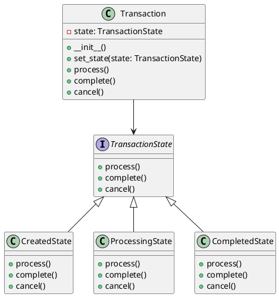

# Python

Мы — команда программистов в финтехе. Наша задача — создавать надежные и эффективные системы для обработки финансовых транзакций. В этом кейсе мы рассмотрим, как применить паттерн "Состояние" для обработки различных состояний транзакций в банковской системе.

### Описание кейса

В банковской системе транзакции могут находиться в разных состояниях: создана, обрабатывается, завершена, отклонена и т.д. Каждое состояние имеет свои правила и поведение. Например, транзакция в состоянии "создана" может быть отменена, а в состоянии "завершена" — нет. Паттерн "Состояние" позволяет нам легко управлять этими состояниями и их переходами.

### Применение паттерна

Паттерн "Состояние" позволяет объекту изменять свое поведение в зависимости от внутреннего состояния. Вместо того чтобы использовать большие условные конструкции, мы создаем отдельные классы для каждого состояния и делегируем им выполнение операций.

### Пример кода на Python

**1. Определение интерфейса состояния**


```python
from abc import ABC, abstractmethod

class TransactionState(ABC):
    @abstractmethod
    def process(self):
        pass

    @abstractmethod
    def complete(self):
        pass

    @abstractmethod
    def cancel(self):
        pass
```


**2. Создание конкретных состояний**


```python
class CreatedState(TransactionState):
    def process(self):
        print("Транзакция обрабатывается...")
        # Логика обработки транзакции

    def complete(self):
        print("Транзакция не может быть завершена в состоянии 'создана'")

    def cancel(self):
        print("Транзакция отменена.")
        # Логика отмены транзакции

class ProcessingState(TransactionState):
    def process(self):
        print("Транзакция уже обрабатывается...")

    def complete(self):
        print("Транзакция завершена.")
        # Логика завершения транзакции

    def cancel(self):
        print("Транзакция не может быть отменена в состоянии 'обрабатывается'")

class CompletedState(TransactionState):
    def process(self):
        print("Транзакция не может быть обработана в состоянии 'завершена'")

    def complete(self):
        print("Транзакция уже завершена.")

    def cancel(self):
        print("Транзакция не может быть отменена в состоянии 'завершена'")
```


**3. Создание контекста**


```python
class Transaction:
    def __init__(self):
        self.state = CreatedState()

    def set_state(self, state):
        self.state = state

    def process(self):
        self.state.process()
        self.set_state(ProcessingState())

    def complete(self):
        self.state.complete()
        self.set_state(CompletedState())

    def cancel(self):
        self.state.cancel()
        self.set_state(CreatedState())
```


#### Пример использования


```python
if __name__ == "__main__":
    transaction = Transaction()

    transaction.process()  # Транзакция обрабатывается...
    transaction.complete()  # Транзакция завершена.
    transaction.cancel()  # Транзакция не может быть отменена в состоянии 'завершена'
```


### UML диаграмма

<figure><figcaption><p>UML диаграмма для паттерна "Состояние"</p></figcaption></figure>





### Вывод для кейса

Паттерн "Состояние" позволяет нам гибко управлять различными состояниями транзакций в банковской системе. Мы создали отдельные классы для каждого состояния и делегировали им выполнение операций. Это упрощает код, делает его более читаемым и поддерживаемым. Теперь, если нам нужно добавить новое состояние или изменить поведение существующего, мы можем сделать это без изменения основного кода транзакции.
