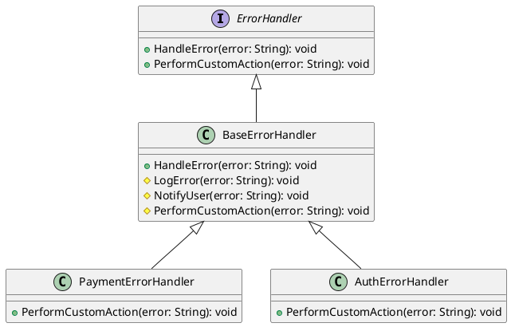

# Go

Мы — департамент разработки в ведущем маркетплейсе РФ. Наша задача — создавать надежные и масштабируемые системы, которые обеспечивают бесперебойную работу нашего сервиса. Одной из важных задач является обработка ошибок и исключений, чтобы пользователи не сталкивались с неприятными сюрпризами.

### Описание

В этом кейсе мы рассмотрим, как применить паттерн "Шаблонный метод" для обработки ошибок и исключений. Этот паттерн позволяет нам определить общий алгоритм обработки ошибок, при этом предоставляя возможность подклассам переопределять отдельные шаги этого алгоритма.

### Применение паттерна

Паттерн "Шаблонный метод" позволяет нам создать базовый класс, который определяет общий алгоритм обработки ошибок. Подклассы могут переопределять отдельные шаги этого алгоритма, чтобы адаптировать его под свои нужды. Это особенно полезно, когда у нас есть несколько типов ошибок, которые требуют различной обработки.

### Пример кода на Go

**Базовый класс**


```go
package main

import "fmt"

// Базовый класс для обработки ошибок
type ErrorHandler interface {
    HandleError(error string)
    PerformCustomAction(error string)
}

// Базовый класс с шаблонным методом
type BaseErrorHandler struct{}

func (b *BaseErrorHandler) HandleError(error string) {
    b.LogError(error)
    b.NotifyUser(error)
    b.PerformCustomAction(error)
}

func (b *BaseErrorHandler) LogError(error string) {
    fmt.Println("Логирование ошибки:", error)
}

func (b *BaseErrorHandler) NotifyUser(error string) {
    fmt.Println("Уведомление пользователя об ошибке:", error)
}

func (b *BaseErrorHandler) PerformCustomAction(error string) {
    // Пустой метод, который будет переопределен в подклассах
}
```


**Подкласс для обработки ошибок платежей**


```go
type PaymentErrorHandler struct {
    BaseErrorHandler
}

func (p *PaymentErrorHandler) PerformCustomAction(error string) {
    fmt.Println("Выполнение пользовательских действий для ошибки платежа:", error)
}
```


**Подкласс для обработки ошибок авторизации**


```go
type AuthErrorHandler struct {
    BaseErrorHandler
}

func (a *AuthErrorHandler) PerformCustomAction(error string) {
    fmt.Println("Выполнение пользовательских действий для ошибки авторизации:", error)
}
```


#### Пример использования


```go
func main() {
    // Создание экземпляра обработчика ошибок платежей
    paymentErrorHandler := &PaymentErrorHandler{}
    paymentErrorHandler.HandleError("Ошибка платежа: недостаточно средств")

    fmt.Println()

    // Создание экземпляра обработчика ошибок авторизации
    authErrorHandler := &AuthErrorHandler{}
    authErrorHandler.HandleError("Ошибка авторизации: неверный пароль")
}
```


### UML диаграмма

<figure><figcaption><p>UML диаграмма для паттерна "Шаблонный метод"</p></figcaption></figure>



### Вывод для кейса

Паттерн "Шаблонный метод" позволяет нам создать гибкую систему обработки ошибок, которая легко расширяется и адаптируется под различные типы ошибок. В данном кейсе мы создали базовый класс `BaseErrorHandler`, который определяет общий алгоритм обработки ошибок. Подклассы `PaymentErrorHandler` и `AuthErrorHandler` переопределяют метод `PerformCustomAction`, чтобы выполнять специфические действия для своих типов ошибок. Это позволяет нам легко добавлять новые типы ошибок и обработчиков, не изменяя основной алгоритм.
