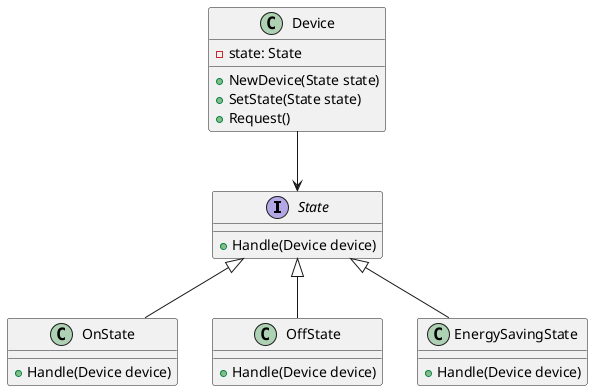

# Go

Мы — инженерная лаборатория, которая занимается разработкой и внедрением решений в области Интернета вещей (IoT). Наша цель — создать умные и эффективные системы, которые упрощают жизнь и делают её комфортнее. Сегодня мы рассмотрим, как применить паттерн "Состояние" для управления состоянием устройств в системе IoT.

### Описание кейса

Представьте, что у нас есть умный дом с различными устройствами: лампочками, термостатами, дверными замками и т.д. Каждое устройство может находиться в разных состояниях: включено, выключено, в режиме энергосбережения и т.д. Нам нужно управлять этими состояниями и переключаться между ними в зависимости от различных условий.

### Применение паттерна "Состояние"

Паттерн "Состояние" позволяет объекту изменять своё поведение в зависимости от внутреннего состояния. Это особенно полезно для управления состояниями устройств в системе IoT, где устройства могут иметь множество состояний и переключаться между ними.

### Пример кода на Go

**1. Определение интерфейса состояния**


```go
package main

import "fmt"

type State interface {
    Handle(device *Device)
}
```


**2. Реализация конкретных состояний**


```go
type OnState struct{}

func (s *OnState) Handle(device *Device) {
    fmt.Println("Устройство включено.")
    // Логика для состояния "включено"
}

type OffState struct{}

func (s *OffState) Handle(device *Device) {
    fmt.Println("Устройство выключено.")
    // Логика для состояния "выключено"
}

type EnergySavingState struct{}

func (s *EnergySavingState) Handle(device *Device) {
    fmt.Println("Устройство в режиме энергосбережения.")
    // Логика для состояния "энергосбережение"
}
```


**3. Определение класса устройства**


```go
type Device struct {
    state State
}

func NewDevice(state State) *Device {
    return &Device{state: state}
}

func (d *Device) SetState(state State) {
    d.state = state
}

func (d *Device) Request() {
    d.state.Handle(d)
}
```


#### Пример использования


```go
func main() {
    device := NewDevice(&OffState{})
    device.Request() // Устройство выключено.

    device.SetState(&OnState{})
    device.Request() // Устройство включено.

    device.SetState(&EnergySavingState{})
    device.Request() // Устройство в режиме энергосбережения.
}
```


### UML диаграмма

<figure><figcaption><p>UML диаграмма для паттерна "Состояние"</p></figcaption></figure>





### Вывод для кейса

Паттерн "Состояние" позволяет нам гибко управлять состояниями устройств в системе IoT. Мы можем легко добавлять новые состояния и изменять поведение устройств в зависимости от текущего состояния. Это делает нашу систему более модульной и удобной для расширения.

Надеюсь, этот пример поможет вам лучше понять, как применять паттерн "Состояние" в реальных проектах.
