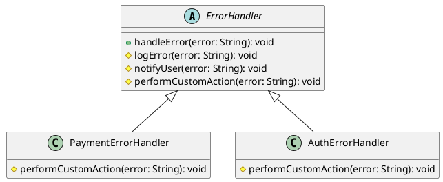

# PHP

Мы — департамент разработки в ведущем маркетплейсе РФ. Наша задача — создавать надежные и масштабируемые системы, которые обеспечивают бесперебойную работу нашего сервиса. Одной из важных задач является обработка ошибок и исключений, чтобы пользователи не сталкивались с неприятными сюрпризами.

### Описание

В этом кейсе мы рассмотрим, как применить паттерн "Шаблонный метод" для обработки ошибок и исключений. Этот паттерн позволяет нам определить общий алгоритм обработки ошибок, при этом предоставляя возможность подклассам переопределять отдельные шаги этого алгоритма.

### Применение паттерна

Паттерн "Шаблонный метод" позволяет нам создать базовый класс, который определяет общий алгоритм обработки ошибок. Подклассы могут переопределять отдельные шаги этого алгоритма, чтобы адаптировать его под свои нужды. Это особенно полезно, когда у нас есть несколько типов ошибок, которые требуют различной обработки.

### Привер кода на PHP

**Базовый класс**


```php
abstract class ErrorHandler {
    // Шаблонный метод, который определяет общий алгоритм обработки ошибок
    public function handleError($error) {
        $this->logError($error);
        $this->notifyUser($error);
        $this->performCustomAction($error);
    }

    // Метод для логирования ошибки
    protected function logError($error) {
        echo "Логирование ошибки: " . $error . "\n";
    }

    // Метод для уведомления пользователя об ошибке
    protected function notifyUser($error) {
        echo "Уведомление пользователя об ошибке: " . $error . "\n";
    }

    // Абстрактный метод для выполнения пользовательских действий
    abstract protected function performCustomAction($error);
}
```


**Подкласс для обработки ошибок платежей**


```php
class PaymentErrorHandler extends ErrorHandler {
    // Переопределение метода для выполнения пользовательских действий
    protected function performCustomAction($error) {
        echo "Выполнение пользовательских действий для ошибки платежа: " . $error . "\n";
    }
}
```


**Подкласс для обработки ошибок авторизации**


```php
class AuthErrorHandler extends ErrorHandler {
    // Переопределение метода для выполнения пользовательских действий
    protected function performCustomAction($error) {
        echo "Выполнение пользовательских действий для ошибки авторизации: " . $error . "\n";
    }
}
```


#### Пример использования


```php
// Создание экземпляра обработчика ошибок платежей
$paymentErrorHandler = new PaymentErrorHandler();
$paymentErrorHandler->handleError("Ошибка платежа: недостаточно средств");

echo "\n";

// Создание экземпляра обработчика ошибок авторизации
$authErrorHandler = new AuthErrorHandler();
$authErrorHandler->handleError("Ошибка авторизации: неверный пароль");
```


#### UML диаграмма

<figure><figcaption><p>UML диаграмма для паттерна "Шаблонный метод"</p></figcaption></figure>





#### Вывод для кейса

Паттерн "Шаблонный метод" позволяет нам создать гибкую систему обработки ошибок, которая легко расширяется и адаптируется под различные типы ошибок. В данном кейсе мы создали базовый класс `ErrorHandler`, который определяет общий алгоритм обработки ошибок. Подклассы `PaymentErrorHandler` и `AuthErrorHandler` переопределяют метод `performCustomAction`, чтобы выполнять специфические действия для своих типов ошибок. Это позволяет нам легко добавлять новые типы ошибок и обработчиков, не изменяя основной алгоритм.
