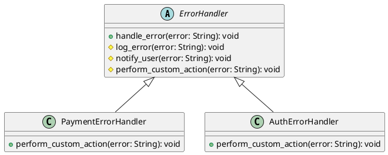

# Python

Мы — департамент разработки в ведущем маркетплейсе РФ. Наша задача — создавать надежные и масштабируемые системы, которые обеспечивают бесперебойную работу нашего сервиса. Одной из важных задач является обработка ошибок и исключений, чтобы пользователи не сталкивались с неприятными сюрпризами.

### Описание кейса

В этом кейсе мы рассмотрим, как применить паттерн "Шаблонный метод" для обработки ошибок и исключений. Этот паттерн позволяет нам определить общий алгоритм обработки ошибок, при этом предоставляя возможность подклассам переопределять отдельные шаги этого алгоритма.

### Применение паттерна

Паттерн "Шаблонный метод" позволяет нам создать базовый класс, который определяет общий алгоритм обработки ошибок. Подклассы могут переопределять отдельные шаги этого алгоритма, чтобы адаптировать его под свои нужды. Это особенно полезно, когда у нас есть несколько типов ошибок, которые требуют различной обработки.

### Пример кода на Python

**Базовый класс**


```python
from abc import ABC, abstractmethod

# Базовый класс для обработки ошибок
class ErrorHandler(ABC):
    def handle_error(self, error):
        self.log_error(error)
        self.notify_user(error)
        self.perform_custom_action(error)

    def log_error(self, error):
        print(f"Логирование ошибки: {error}")

    def notify_user(self, error):
        print(f"Уведомление пользователя об ошибке: {error}")

    @abstractmethod
    def perform_custom_action(self, error):
        pass
```


**Подкласс для обработки ошибок платежей**


```python
class PaymentErrorHandler(ErrorHandler):
    def perform_custom_action(self, error):
        print(f"Выполнение пользовательских действий для ошибки платежа: {error}")
```


**Подкласс для обработки ошибок авторизации**


```python
class AuthErrorHandler(ErrorHandler):
    def perform_custom_action(self, error):
        print(f"Выполнение пользовательских действий для ошибки авторизации: {error}")
```


#### Пример использования


```python
def main():
    # Создание экземпляра обработчика ошибок платежей
    payment_error_handler = PaymentErrorHandler()
    payment_error_handler.handle_error("Ошибка платежа: недостаточно средств")

    print()

    # Создание экземпляра обработчика ошибок авторизации
    auth_error_handler = AuthErrorHandler()
    auth_error_handler.handle_error("Ошибка авторизации: неверный пароль")

if __name__ == "__main__":
    main()
```


### UML диаграмма

<figure><figcaption><p>UML диаграмма для паттерна "Шаблонный метод"</p></figcaption></figure>





### Вывод для кейса

Паттерн "Шаблонный метод" позволяет нам создать гибкую систему обработки ошибок, которая легко расширяется и адаптируется под различные типы ошибок. В данном кейсе мы создали базовый класс `ErrorHandler`, который определяет общий алгоритм обработки ошибок. Подклассы `PaymentErrorHandler` и `AuthErrorHandler` переопределяют метод `perform_custom_action`, чтобы выполнять специфические действия для своих типов ошибок. Это позволяет нам легко добавлять новые типы ошибок и обработчиков, не изменяя основной алгоритм.
