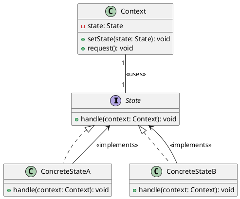

# Состояние (State)

### Описание

Паттерн "Состояние" (State) позволяет объекту изменять свое поведение в зависимости от внутреннего состояния. Этот паттерн похож на паттерн "Стратегия", но его основное отличие заключается в том, что состояния могут изменяться динамически в процессе выполнения программы. Основные компоненты паттерна включают:

1. **Context (Контекст)**: Объект, который содержит ссылку на текущее состояние и делегирует ему выполнение запросов. Контекст предоставляет интерфейс для клиентов и может изменять свое состояние.
2. **State (Состояние)**: Интерфейс, который определяет методы, которые должны быть реализованы всеми конкретными состояниями. Эти методы описывают поведение, которое может изменяться в зависимости от состояния.
3. **ConcreteState (Конкретное состояние)**: Реализация интерфейса State, которая определяет конкретное поведение для каждого состояния. Конкретные состояния могут изменять состояние контекста и переключаться на другие состояния.

### UML диаграмма

### Преимущества

1. **Разделение ответственности**: Контекст и состояния имеют четко разделенные обязанности, что упрощает поддержку и расширение кода.
2. **Гибкость**: Легко добавлять и удалять состояния без изменения контекста.
3. **Динамическое поведение**: Позволяет динамически изменять поведение объектов в зависимости от их состояния.

### Недостатки

1. **Сложность**: Введение паттерна "Состояние" может усложнить код, особенно если состояний много.
2. **Производительность**: Переключение между состояниями может потребовать дополнительных ресурсов.

### Применение

1. **Системы управления состоянием**: Когда нужно реализовать механизм управления состоянием объектов.
2. **Системы автоматов**: Когда нужно реализовать конечные автоматы или машины состояний.
3. **Игры и симуляции**: В играх и симуляциях для управления поведением персонажей или объектов в зависимости от их состояния.

### Примеры использования

1. **Пользовательские интерфейсы**: В графических интерфейсах для управления состоянием элементов интерфейса, таких как кнопки или меню.
2. **Системы управления задачами**: В системах управления задачами для управления состоянием задач (например, "в процессе", "завершено").
3. **Системы мониторинга**: В системах мониторинга для управления состоянием серверов и устройств (например, "активно", "неактивно").

Эта диаграмма иллюстрирует основные компоненты паттерна "Состояние" и их взаимосвязи. Контекст использует состояние для делегирования запросов, а конкретные состояния реализуют интерфейс состояния и определяют конкретное поведение.
