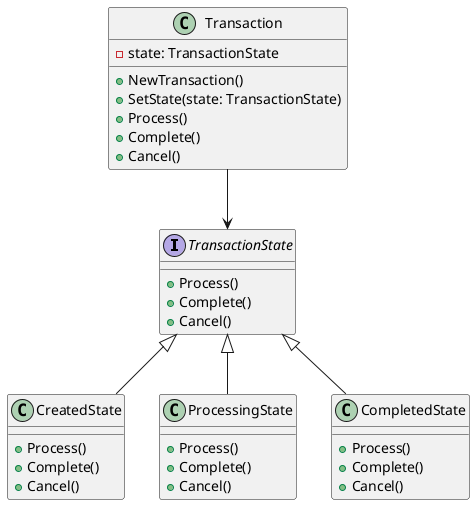

# Go

Мы — команда программистов в финтехе. Наша задача — создавать надежные и эффективные системы для обработки финансовых транзакций. В этом кейсе мы рассмотрим, как применить паттерн "Состояние" для обработки различных состояний транзакций в банковской системе.

#### Описание кейса

В банковской системе транзакции могут находиться в разных состояниях: создана, обрабатывается, завершена, отклонена и т.д. Каждое состояние имеет свои правила и поведение. Например, транзакция в состоянии "создана" может быть отменена, а в состоянии "завершена" — нет. Паттерн "Состояние" позволяет нам легко управлять этими состояниями и их переходами.

#### Применение паттерна

Паттерн "Состояние" позволяет объекту изменять свое поведение в зависимости от внутреннего состояния. Вместо того чтобы использовать большие условные конструкции, мы создаем отдельные классы для каждого состояния и делегируем им выполнение операций.

#### Код

**1. Определение интерфейса состояния**

```go
package main

import "fmt"

type TransactionState interface {
    Process()
    Complete()
    Cancel()
}
```

**2. Создание конкретных состояний**

```go
type CreatedState struct{}

func (s *CreatedState) Process() {
    fmt.Println("Транзакция обрабатывается...")
    // Логика обработки транзакции
}

func (s *CreatedState) Complete() {
    fmt.Println("Транзакция не может быть завершена в состоянии 'создана'")
}

func (s *CreatedState) Cancel() {
    fmt.Println("Транзакция отменена.")
    // Логика отмены транзакции
}

type ProcessingState struct{}

func (s *ProcessingState) Process() {
    fmt.Println("Транзакция уже обрабатывается...")
}

func (s *ProcessingState) Complete() {
    fmt.Println("Транзакция завершена.")
    // Логика завершения транзакции
}

func (s *ProcessingState) Cancel() {
    fmt.Println("Транзакция не может быть отменена в состоянии 'обрабатывается'")
}

type CompletedState struct{}

func (s *CompletedState) Process() {
    fmt.Println("Транзакция не может быть обработана в состоянии 'завершена'")
}

func (s *CompletedState) Complete() {
    fmt.Println("Транзакция уже завершена.")
}

func (s *CompletedState) Cancel() {
    fmt.Println("Транзакция не может быть отменена в состоянии 'завершена'")
}
```

**3. Создание контекста**


```go
type Transaction struct {
    state TransactionState
}

func NewTransaction() *Transaction {
    return &Transaction{state: &CreatedState{}}
}

func (t *Transaction) SetState(state TransactionState) {
    t.state = state
}

func (t *Transaction) Process() {
    t.state.Process()
    t.SetState(&ProcessingState{})
}

func (t *Transaction) Complete() {
    t.state.Complete()
    t.SetState(&CompletedState{})
}

func (t *Transaction) Cancel() {
    t.state.Cancel()
    t.SetState(&CreatedState{})
}
```


#### Пример использования


```go
func main() {
    transaction := NewTransaction()

    transaction.Process() // Транзакция обрабатывается...
    transaction.Complete() // Транзакция завершена.
    transaction.Cancel() // Транзакция не может быть отменена в состоянии 'завершена'
}
```


### UML диаграмма

<figure><figcaption><p>UML диаграмма для паттерна "Состояние"</p></figcaption></figure>





### Вывод для кейса

Паттерн "Состояние" позволяет нам гибко управлять различными состояниями транзакций в банковской системе. Мы создали отдельные классы для каждого состояния и делегировали им выполнение операций. Это упрощает код, делает его более читаемым и поддерживаемым. Теперь, если нам нужно добавить новое состояние или изменить поведение существующего, мы можем сделать это без изменения основного кода транзакции.
