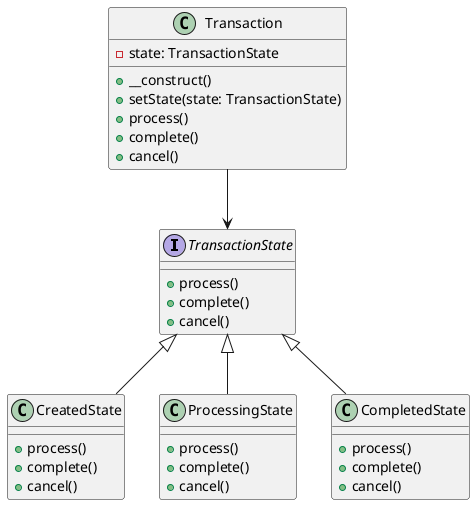

# PHP

Мы — команда программистов в финтехе. Наша задача — создавать надежные и эффективные системы для обработки финансовых транзакций. В этом кейсе мы рассмотрим, как применить паттерн "Состояние" для обработки различных состояний транзакций в банковской системе.

### Описание кейса

В банковской системе транзакции могут находиться в разных состояниях: создана, обрабатывается, завершена, отклонена и т.д. Каждое состояние имеет свои правила и поведение. Например, транзакция в состоянии "создана" может быть отменена, а в состоянии "завершена" — нет. Паттерн "Состояние" позволяет нам легко управлять этими состояниями и их переходами.

### Применение паттерна

Паттерн "Состояние" позволяет объекту изменять свое поведение в зависимости от внутреннего состояния. Вместо того чтобы использовать большие условные конструкции, мы создаем отдельные классы для каждого состояния и делегируем им выполнение операций.

### Пример кода на PHP

**1. Определение интерфейса состояния**


```php
<?php
interface TransactionState {
    public function process();
    public function complete();
    public function cancel();
}
?>
```


**2. Создание конкретных состояний**


```php
<?php
class CreatedState implements TransactionState {
    public function process() {
        echo "Транзакция обрабатывается...\n";
        // Логика обработки транзакции
    }

    public function complete() {
        echo "Транзакция не может быть завершена в состоянии 'создана'\n";
    }

    public function cancel() {
        echo "Транзакция отменена.\n";
        // Логика отмены транзакции
    }
}

class ProcessingState implements TransactionState {
    public function process() {
        echo "Транзакция уже обрабатывается...\n";
    }

    public function complete() {
        echo "Транзакция завершена.\n";
        // Логика завершения транзакции
    }

    public function cancel() {
        echo "Транзакция не может быть отменена в состоянии 'обрабатывается'\n";
    }
}

class CompletedState implements TransactionState {
    public function process() {
        echo "Транзакция не может быть обработана в состоянии 'завершена'\n";
    }

    public function complete() {
        echo "Транзакция уже завершена.\n";
    }

    public function cancel() {
        echo "Транзакция не может быть отменена в состоянии 'завершена'\n";
    }
}
?>
```


**3. Создание контекста**


```php
<?php
class Transaction {
    private $state;

    public function __construct() {
        $this->setState(new CreatedState());
    }

    public function setState(TransactionState $state) {
        $this->state = $state;
    }

    public function process() {
        $this->state->process();
        $this->setState(new ProcessingState());
    }

    public function complete() {
        $this->state->complete();
        $this->setState(new CompletedState());
    }

    public function cancel() {
        $this->state->cancel();
        $this->setState(new CreatedState());
    }
}
?>
```


#### Пример использования


```php
<?php
$transaction = new Transaction();

$transaction->process(); // Транзакция обрабатывается...
$transaction->complete(); // Транзакция завершена.
$transaction->cancel(); // Транзакция не может быть отменена в состоянии 'завершена'
?>
```


### UML диаграмма

<figure><figcaption><p>UML диаграмма для паттерна "Состояние"</p></figcaption></figure>





### Вывод для кейса

Паттерн "Состояние" позволяет нам гибко управлять различными состояниями транзакций в банковской системе. Мы создали отдельные классы для каждого состояния и делегировали им выполнение операций. Это упрощает код, делает его более читаемым и поддерживаемым. Теперь, если нам нужно добавить новое состояние или изменить поведение существующего, мы можем сделать это без изменения основного кода транзакции.
