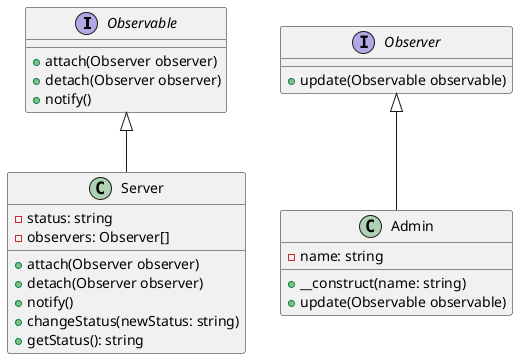

# PHP

Мы — команда разработчиков, которая занимается созданием систем мониторинга состояния серверов. Наша задача — обеспечить надежное и своевременное уведомление о состоянии серверов, чтобы администраторы могли оперативно реагировать на любые изменения.

### Описание кейса

В этом кейсе мы рассмотрим, как применить паттерн "Наблюдатель" (Observer) для мониторинга состояния серверов. Паттерн "Наблюдатель" позволяет объектам (наблюдателям) получать уведомления о событиях, происходящих в других объектах (наблюдаемых). В нашем случае сервер будет наблюдаемым объектом, а администраторы — наблюдателями.

### Применение паттерна

Паттерн "Наблюдатель" поможет нам реализовать систему, в которой серверы будут уведомлять администраторов о своем состоянии. Это позволит администраторам своевременно реагировать на любые изменения, такие как перегрузка, отказ оборудования и т.д.

### Пример кода на PHP

**1. Определение интерфейсов**


```php
// Интерфейс для наблюдаемых объектов (серверов)
interface Observable {
    public function attach(Observer $observer);
    public function detach(Observer $observer);
    public function notify();
}

// Интерфейс для наблюдателей (администраторов)
interface Observer {
    public function update(Observable $observable);
}
```


**2. Реализация наблюдаемого объекта (сервера)**


```php
class Server implements Observable {
    private $status;
    private $observers = [];

    public function attach(Observer $observer) {
        $this->observers[] = $observer;
    }

    public function detach(Observer $observer) {
        $this->observers = array_filter($this->observers, function($obs) use ($observer) {
            return $obs !== $observer;
        });
    }

    public function notify() {
        foreach ($this->observers as $observer) {
            $observer->update($this);
        }
    }

    public function changeStatus($newStatus) {
        $this->status = $newStatus;
        $this->notify();
    }

    public function getStatus() {
        return $this->status;
    }
}
```


**3. Реализация наблюдателя (администратора)**


```php
class Admin implements Observer {
    private $name;

    public function __construct($name) {
        $this->name = $name;
    }

    public function update(Observable $observable) {
        echo "Администратор {$this->name} получил уведомление: состояние сервера изменилось на {$observable->getStatus()}\n";
    }
}
```


#### Пример использования


```php
// Создаем сервер
$server = new Server();

// Создаем администраторов
$admin1 = new Admin("Админ 1");
$admin2 = new Admin("Админ 2");

// Подписываем администраторов на уведомления от сервера
$server->attach($admin1);
$server->attach($admin2);

// Изменяем состояние сервера
$server->changeStatus("Перегрузка");

// Отписываем одного администратора
$server->detach($admin1);

// Изменяем состояние сервера еще раз
$server->changeStatus("Нормально");
```


### UML диаграмма

<figure><figcaption><p>UML диаграмма для паттерна "Наблюдатель"</p></figcaption></figure>





### Вывод для кейса

Паттерн "Наблюдатель" позволяет нам создать гибкую систему мониторинга состояния серверов. Администраторы могут подписываться на уведомления от серверов и своевременно получать информацию о любых изменениях. Это помогает оперативно реагировать на проблемы и поддерживать стабильную работу серверов.
