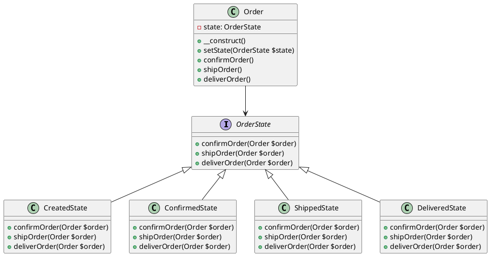

# PHP

Мы — департамент разработки в ведущем маркетплейсе РФ. Наша задача — создавать и поддерживать платформу, которая позволяет пользователям легко и удобно совершать покупки. Одной из важных задач является обработка заказов. Заказы проходят через несколько состояний: создание, подтверждение, отправка и доставка. Для управления этими состояниями мы используем паттерн проектирования "Состояние".

### Описание кейса

В нашем маркетплейсе заказ может находиться в одном из следующих состояний:

1. **Создан** — заказ только что создан пользователем.
2. **Подтвержден** — заказ подтвержден продавцом.
3. **Отправлен** — заказ отправлен курьером.
4. **Доставлен** — заказ доставлен пользователю.

Каждое состояние имеет свои действия и ограничения. Например, заказ в состоянии "Создан" не может быть отправлен, пока не будет подтвержден. Паттерн "Состояние" позволяет нам легко управлять этими состояниями и их переходами.

### Применение паттерна

Паттерн "Состояние" позволяет объекту изменять свое поведение в зависимости от его внутреннего состояния. В нашем случае, это позволяет заказу изменять свое поведение в зависимости от текущего состояния (создан, подтвержден, отправлен, доставлен).

### Пример кода на PHP

**1. Определение интерфейса состояния**


```php
<?php

interface OrderState {
    public function confirmOrder(Order $order);
    public function shipOrder(Order $order);
    public function deliverOrder(Order $order);
}
```


**2. Реализация конкретных состояний**


```php
<?php

class CreatedState implements OrderState {
    public function confirmOrder(Order $order) {
        $order->setState(new ConfirmedState());
        echo "Заказ подтвержден.\n";
    }

    public function shipOrder(Order $order) {
        echo "Заказ не может быть отправлен, пока не подтвержден.\n";
    }

    public function deliverOrder(Order $order) {
        echo "Заказ не может быть доставлен, пока не отправлен.\n";
    }
}

class ConfirmedState implements OrderState {
    public function confirmOrder(Order $order) {
        echo "Заказ уже подтвержден.\n";
    }

    public function shipOrder(Order $order) {
        $order->setState(new ShippedState());
        echo "Заказ отправлен.\n";
    }

    public function deliverOrder(Order $order) {
        echo "Заказ не может быть доставлен, пока не отправлен.\n";
    }
}

class ShippedState implements OrderState {
    public function confirmOrder(Order $order) {
        echo "Заказ уже подтвержден.\n";
    }

    public function shipOrder(Order $order) {
        echo "Заказ уже отправлен.\n";
    }

    public function deliverOrder(Order $order) {
        $order->setState(new DeliveredState());
        echo "Заказ доставлен.\n";
    }
}

class DeliveredState implements OrderState {
    public function confirmOrder(Order $order) {
        echo "Заказ уже подтвержден.\n";
    }

    public function shipOrder(Order $order) {
        echo "Заказ уже отправлен.\n";
    }

    public function deliverOrder(Order $order) {
        echo "Заказ уже доставлен.\n";
    }
}
```


**3. Класс заказа**


```php
<?php

class Order {
    private $state;

    public function __construct() {
        $this->state = new CreatedState();
    }

    public function setState(OrderState $state) {
        $this->state = $state;
    }

    public function confirmOrder() {
        $this->state->confirmOrder($this);
    }

    public function shipOrder() {
        $this->state->shipOrder($this);
    }

    public function deliverOrder() {
        $this->state->deliverOrder($this);
    }
}
```


#### Пример использования


```php
<?php

$order = new Order();
$order->confirmOrder(); // Заказ подтвержден.
$order->shipOrder(); // Заказ отправлен.
$order->deliverOrder(); // Заказ доставлен.
```


### UML диаграмма

<figure><figcaption><p>UML диаграмма для паттерна "Состояние"</p></figcaption></figure>





### Вывод для кейса

Паттерн "Состояние" позволяет нам гибко управлять различными состояниями заказа и их переходами. Это делает код более чистым и понятным, а также облегчает его расширение и поддержку. В нашем примере мы видим, как легко можно добавить новые состояния или изменить поведение существующих, не изменяя основной логики заказа. Это особенно полезно в больших проектах, где состояния и их переходы могут быть сложными и многочисленными.
