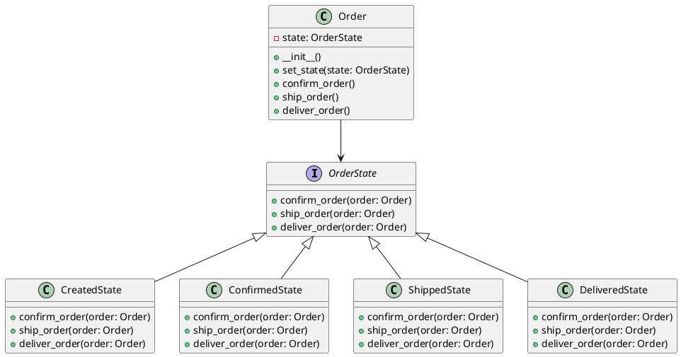

# Python

Мы — департамент разработки в ведущем маркетплейсе РФ. Наша задача — создавать и поддерживать платформу, которая позволяет пользователям легко и удобно совершать покупки. Одной из важных задач является обработка заказов. Заказы проходят через несколько состояний: создание, подтверждение, отправка и доставка. Для управления этими состояниями мы используем паттерн проектирования "Состояние".

### Описание кейса

В нашем маркетплейсе заказ может находиться в одном из следующих состояний:

1. **Создан** — заказ только что создан пользователем.
2. **Подтвержден** — заказ подтвержден продавцом.
3. **Отправлен** — заказ отправлен курьером.
4. **Доставлен** — заказ доставлен пользователю.

Каждое состояние имеет свои действия и ограничения. Например, заказ в состоянии "Создан" не может быть отправлен, пока не будет подтвержден. Паттерн "Состояние" позволяет нам легко управлять этими состояниями и их переходами.

### Применение паттерна

Паттерн "Состояние" позволяет объекту изменять свое поведение в зависимости от его внутреннего состояния. В нашем случае, это позволяет заказу изменять свое поведение в зависимости от текущего состояния (создан, подтвержден, отправлен, доставлен).

### Пример кода на Python

**1. Определение интерфейса состояния**


```python
from abc import ABC, abstractmethod

class OrderState(ABC):
    @abstractmethod
    def confirm_order(self, order):
        pass

    @abstractmethod
    def ship_order(self, order):
        pass

    @abstractmethod
    def deliver_order(self, order):
        pass
```


**2. Реализация конкретных состояний**


```python
class CreatedState(OrderState):
    def confirm_order(self, order):
        order.set_state(ConfirmedState())
        print("Заказ подтвержден.")

    def ship_order(self, order):
        print("Заказ не может быть отправлен, пока не подтвержден.")

    def deliver_order(self, order):
        print("Заказ не может быть доставлен, пока не отправлен.")

class ConfirmedState(OrderState):
    def confirm_order(self, order):
        print("Заказ уже подтвержден.")

    def ship_order(self, order):
        order.set_state(ShippedState())
        print("Заказ отправлен.")

    def deliver_order(self, order):
        print("Заказ не может быть доставлен, пока не отправлен.")

class ShippedState(OrderState):
    def confirm_order(self, order):
        print("Заказ уже подтвержден.")

    def ship_order(self, order):
        print("Заказ уже отправлен.")

    def deliver_order(self, order):
        order.set_state(DeliveredState())
        print("Заказ доставлен.")

class DeliveredState(OrderState):
    def confirm_order(self, order):
        print("Заказ уже подтвержден.")

    def ship_order(self, order):
        print("Заказ уже отправлен.")

    def deliver_order(self, order):
        print("Заказ уже доставлен.")
```


**3. Класс заказа**


```python
class Order:
    def __init__(self):
        self.state = CreatedState()

    def set_state(self, state):
        self.state = state

    def confirm_order(self):
        self.state.confirm_order(self)

    def ship_order(self):
        self.state.ship_order(self)

    def deliver_order(self):
        self.state.deliver_order(self)
```


#### Пример использования


```python
if __name__ == "__main__":
    order = Order()
    order.confirm_order()  # Заказ подтвержден.
    order.ship_order()     # Заказ отправлен.
    order.deliver_order()  # Заказ доставлен.
```


### UML диаграмма

<figure><figcaption><p>UML диаграмма для паттерна "Состояние"</p></figcaption></figure>





### Вывод для кейса

Паттерн "Состояние" позволяет нам гибко управлять различными состояниями заказа и их переходами. Это делает код более чистым и понятным, а также облегчает его расширение и поддержку. В нашем примере мы видим, как легко можно добавить новые состояния или изменить поведение существующих, не изменяя основной логики заказа. Это особенно полезно в больших проектах, где состояния и их переходы могут быть сложными и многочисленными.
