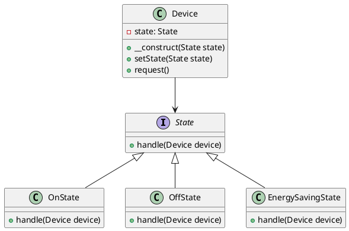

# PHP

Мы — инженерная лаборатория, которая занимается разработкой и внедрением решений в области Интернета вещей (IoT). Наша цель — создать умные и эффективные системы, которые упрощают жизнь и делают её комфортнее. Сегодня мы рассмотрим, как применить паттерн "Состояние" для управления состоянием устройств в системе IoT.

### Описание кейса

Представьте, что у нас есть умный дом с различными устройствами: лампочками, термостатами, дверными замками и т.д. Каждое устройство может находиться в разных состояниях: включено, выключено, в режиме энергосбережения и т.д. Нам нужно управлять этими состояниями и переключаться между ними в зависимости от различных условий.

### Применение паттерна "Состояние"

Паттерн "Состояние" позволяет объекту изменять своё поведение в зависимости от внутреннего состояния. Это особенно полезно для управления состояниями устройств в системе IoT, где устройства могут иметь множество состояний и переключаться между ними.

### Пример кода на PHP

**1. Определение интерфейса состояния**


```php
<?php
interface State {
    public function handle(Device $device);
}
?>
```


**2. Реализация конкретных состояний**


```php
<?php
class OnState implements State {
    public function handle(Device $device) {
        echo "Устройство включено.\n";
        // Логика для состояния "включено"
    }
}

class OffState implements State {
    public function handle(Device $device) {
        echo "Устройство выключено.\n";
        // Логика для состояния "выключено"
    }
}

class EnergySavingState implements State {
    public function handle(Device $device) {
        echo "Устройство в режиме энергосбережения.\n";
        // Логика для состояния "энергосбережение"
    }
}
?>
```


**3. Определение класса устройства**


```php
<?php
class Device {
    private $state;

    public function __construct(State $state) {
        $this->setState($state);
    }

    public function setState(State $state) {
        $this->state = $state;
    }

    public function request() {
        $this->state->handle($this);
    }
}
?>
```


#### Пример использования


```php
<?php
$device = new Device(new OffState());
$device->request(); // Устройство выключено.

$device->setState(new OnState());
$device->request(); // Устройство включено.

$device->setState(new EnergySavingState());
$device->request(); // Устройство в режиме энергосбережения.
?>
```


### UML диаграмма

<figure><figcaption><p>UML диаграмма для паттерна "Состояние"</p></figcaption></figure>





### Вывод для кейса

Паттерн "Состояние" позволяет нам гибко управлять состояниями устройств в системе IoT. Мы можем легко добавлять новые состояния и изменять поведение устройств в зависимости от текущего состояния. Это делает нашу систему более модульной и удобной для расширения.

Надеюсь, этот пример поможет вам лучше понять, как применять паттерн "Состояние" в реальных проектах.
