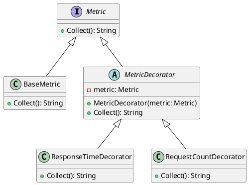

# Go

Представьте, что мы разрабатываем систему мониторинга для веб-приложения. Наша задача — собирать различные метрики, такие как время отклика, количество запросов и т.д. Мы хотим, чтобы наша система была гибкой и легко расширяемой, чтобы в будущем можно было добавлять новые метрики без изменения существующего кода.

Для этого мы будем использовать паттерн "Декоратор". Этот паттерн позволяет динамически добавлять новое поведение объектам, оборачивая их в объекты классов декораторов.

#### Пример кода на Go

**1. Базовый интерфейс**


```go
package main

import "fmt"

type Metric interface {
    Collect() string
}
```


**2. Базовый класс метрики**


```go
type BaseMetric struct{}

func (bm BaseMetric) Collect() string {
    // Базовая реализация сбора метрик
    return "Сбор базовых метрик"
}
```


**3. Базовый класс декоратора**


```go
type MetricDecorator struct {
    metric Metric
}

func (md MetricDecorator) Collect() string {
    return md.metric.Collect()
}
```


**4. Декоратор для сбора времени отклика**


```go
type ResponseTimeDecorator struct {
    MetricDecorator
}

func (rt ResponseTimeDecorator) Collect() string {
    // Логика сбора времени отклика
    result := rt.MetricDecorator.Collect()
    return result + " + Время отклика"
}
```


**5. Декоратор для сбора количества запросов**


```go
type RequestCountDecorator struct {
    MetricDecorator
}

func (rc RequestCountDecorator) Collect() string {
    // Логика сбора количества запросов
    result := rc.MetricDecorator.Collect()
    return result + " + Количество запросов"
}
```


**6. Использование декораторов**


```go
func main() {
    baseMetric := BaseMetric{}
    responseTimeMetric := ResponseTimeDecorator{MetricDecorator{metric: baseMetric}}
    requestCountMetric := RequestCountDecorator{MetricDecorator{metric: responseTimeMetric}}

    fmt.Println(requestCountMetric.Collect())
    // Вывод: Сбор базовых метрик + Время отклика + Количество запросов
}
```


#### UML диаграмма

<figure><figcaption><p>UML диаграмма для паттерна "Декоратор"</p></figcaption></figure>



#### Вывод

Использование паттерна "Декоратор" позволяет нам гибко и легко добавлять новые метрики в нашу систему мониторинга. Мы можем оборачивать базовые метрики в декораторы, которые добавляют дополнительное поведение, не изменяя существующий код. Это делает нашу систему более модульной и удобной для расширения в будущем.
