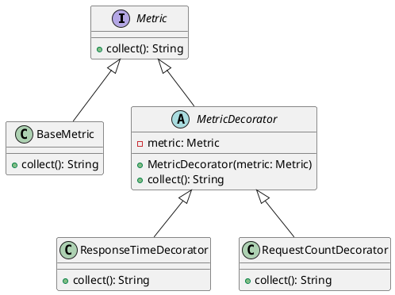

# PHP

Представьте, что мы разрабатываем систему мониторинга для веб-приложения. Наша задача — собирать различные метрики, такие как время отклика, количество запросов и т.д. Мы хотим, чтобы наша система была гибкой и легко расширяемой, чтобы в будущем можно было добавлять новые метрики без изменения существующего кода.

Для этого мы будем использовать паттерн "Декоратор". Этот паттерн позволяет динамически добавлять новое поведение объектам, оборачивая их в объекты классов декораторов.

#### Пример кода на PHP

**1. Базовый интерфейс**


```php
<?php
interface Metric {
    public function collect();
}
```


**2. Базовый класс метрики**


```php
<?php
class BaseMetric implements Metric {
    public function collect() {
        // Базовая реализация сбора метрик
        return "Сбор базовых метрик";
    }
}
```


**3. Базовый класс декоратора**


```php
<?php
abstract class MetricDecorator implements Metric {
    protected $metric;

    public function __construct(Metric $metric) {
        $this->metric = $metric;
    }

    public function collect() {
        return $this->metric->collect();
    }
}
```


**4. Декоратор для сбора времени отклика**


```php
<?php
class ResponseTimeDecorator extends MetricDecorator {
    public function collect() {
        // Логика сбора времени отклика
        $result = $this->metric->collect();
        return $result . " + Время отклика";
    }
}
```


**5. Декоратор для сбора количества запросов**


```php
<?php
class RequestCountDecorator extends MetricDecorator {
    public function collect() {
        // Логика сбора количества запросов
        $result = $this->metric->collect();
        return $result . " + Количество запросов";
    }
}
```


**6. Использование декораторов**


```php
<?php
$baseMetric = new BaseMetric();
$responseTimeMetric = new ResponseTimeDecorator($baseMetric);
$requestCountMetric = new RequestCountDecorator($responseTimeMetric);

echo $requestCountMetric->collect();
// Вывод: Сбор базовых метрик + Время отклика + Количество запросов
```


#### UML диаграмма

<figure><figcaption><p>UML диаграмма для паттерна "Декоратор"</p></figcaption></figure>





#### Вывод

Использование паттерна "Декоратор" позволяет нам гибко и легко добавлять новые метрики в нашу систему мониторинга. Мы можем оборачивать базовые метрики в декораторы, которые добавляют дополнительное поведение, не изменяя существующий код. Это делает нашу систему более модульной и удобной для расширения в будущем.
