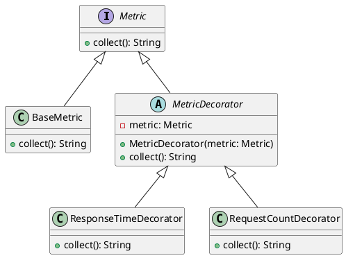

# Python

Представьте, что мы разрабатываем систему мониторинга для веб-приложения. Наша задача — собирать различные метрики, такие как время отклика, количество запросов и т.д. Мы хотим, чтобы наша система была гибкой и легко расширяемой, чтобы в будущем можно было добавлять новые метрики без изменения существующего кода.

Для этого мы будем использовать паттерн "Декоратор". Этот паттерн позволяет динамически добавлять новое поведение объектам, оборачивая их в объекты классов декораторов.

#### Пример кода на Python

**1. Базовый интерфейс**


```python
from abc import ABC, abstractmethod

class Metric(ABC):
    @abstractmethod
    def collect(self):
        pass
```


**2. Базовый класс метрики**


```python
class BaseMetric(Metric):
    def collect(self):
        # Базовая реализация сбора метрик
        return "Сбор базовых метрик"
```


**3. Базовый класс декоратора**


```python
class MetricDecorator(Metric):
    def __init__(self, metric: Metric):
        self._metric = metric

    def collect(self):
        return self._metric.collect()
```


**4. Декоратор для сбора времени отклика**


```python
class ResponseTimeDecorator(MetricDecorator):
    def collect(self):
        # Логика сбора времени отклика
        result = self._metric.collect()
        return result + " + Время отклика"
```


**5. Декоратор для сбора количества запросов**


```python
class RequestCountDecorator(MetricDecorator):
    def collect(self):
        # Логика сбора количества запросов
        result = self._metric.collect()
        return result + " + Количество запросов"
```


**6. Использование декораторов**


```python
if __name__ == "__main__":
    base_metric = BaseMetric()
    response_time_metric = ResponseTimeDecorator(base_metric)
    request_count_metric = RequestCountDecorator(response_time_metric)

    print(request_count_metric.collect())
    # Вывод: Сбор базовых метрик + Время отклика + Количество запросов
```


#### UML диаграмма

<figure><figcaption><p>UML диаграмма для паттерна "Декоратор"</p></figcaption></figure>





#### Вывод

Использование паттерна "Декоратор" позволяет нам гибко и легко добавлять новые метрики в нашу систему мониторинга. Мы можем оборачивать базовые метрики в декораторы, которые добавляют дополнительное поведение, не изменяя существующий код. Это делает нашу систему более модульной и удобной для расширения в будущем.
