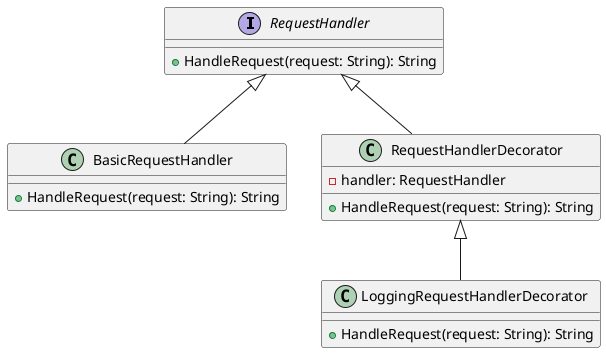

# Go

Представьте, что мы работаем в компании, которая разрабатывает веб-приложения. Наша задача — реализовать систему логирования запросов, чтобы мы могли отслеживать, какие запросы приходят к нашему серверу, и как они обрабатываются. Это поможет нам в отладке и мониторинге.

#### Описание паттерна Декоратор

Паттерн Декоратор позволяет динамически добавлять новое поведение объекту, оборачивая его в объект класса декоратора. Это особенно полезно, когда мы хотим расширить функциональность объекта без изменения его кода.

#### Пример кода на Go

**1. Базовый интерфейс**


```go
package main

import "fmt"

type RequestHandler interface {
    HandleRequest(request string) string
}
```


**2. Базовый класс обработки запросов**


```go
type BasicRequestHandler struct{}

func (h *BasicRequestHandler) HandleRequest(request string) string {
    // Логика обработки запроса
    return "Обработанный запрос: " + request
}
```


**3. Базовый класс декоратора**


```go
type RequestHandlerDecorator struct {
    handler RequestHandler
}

func (d *RequestHandlerDecorator) HandleRequest(request string) string {
    return d.handler.HandleRequest(request)
}
```


**4. Декоратор для логирования**


```go
type LoggingRequestHandlerDecorator struct {
    RequestHandlerDecorator
}

func (d *LoggingRequestHandlerDecorator) HandleRequest(request string) string {
    // Логирование запроса перед обработкой
    fmt.Println("Логирование запроса:", request)

    // Обработка запроса
    result := d.handler.HandleRequest(request)

    // Логирование результата после обработки
    fmt.Println("Логирование результата:", result)

    return result
}
```


**5. Пример использования**


```go
func main() {
    basicHandler := &BasicRequestHandler{}
    loggingHandler := &LoggingRequestHandlerDecorator{RequestHandlerDecorator{handler: basicHandler}}

    request := "GET /api/data"
    result := loggingHandler.HandleRequest(request)

    fmt.Println(result)
}
```


#### Объяснение кода

1. **Базовый интерфейс `RequestHandler`**: Определяет метод `HandleRequest`, который будет реализован в конкретных структурах.
2. **Базовый класс `BasicRequestHandler`**: Реализует интерфейс `RequestHandler` и содержит базовую логику обработки запросов.
3. **Базовый класс декоратора `RequestHandlerDecorator`**: Структура, которая реализует интерфейс `RequestHandler` и принимает объект `RequestHandler` в конструкторе.
4. **Декоратор для логирования `LoggingRequestHandlerDecorator`**: Наследует `RequestHandlerDecorator` и добавляет логирование перед и после обработки запроса.
5. **Пример использования**: Создаем объект базового обработчика и оборачиваем его в декоратор для логирования. Затем вызываем метод `HandleRequest` и выводим результат.

#### UML диаграмма

<figure><figcaption><p>UML диаграмма для паттерна "Декоратор"</p></figcaption></figure>



#### Вывод

Паттерн Декоратор позволяет гибко расширять функциональность объектов без изменения их кода. В нашем кейсе мы использовали этот паттерн для добавления логирования к обработке запросов. Это позволяет нам легко добавлять или убирать логирование, не изменяя основной код обработки запросов. Такой подход делает систему более гибкой и удобной для поддержки.
