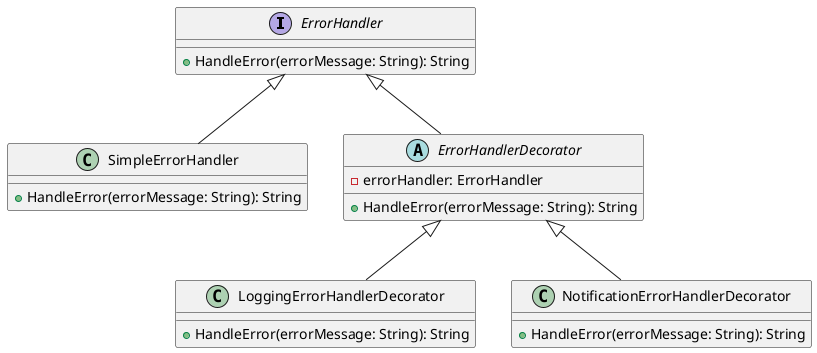

# Go

Мы — команда разработчиков, работающая над веб-приложением для интернет-магазина. Наша цель — создать систему обработки ошибок, которая будет эффективно управлять различными ситуациями, такими как добавление товара в корзину, оформление заказа и другие операции. Мы хотим, чтобы наша система была гибкой и легко расширяемой, чтобы в будущем можно было добавлять новые типы обработки ошибок без изменения существующего кода.

#### Описание паттерна Декоратор

Паттерн Декоратор позволяет динамически добавлять новое поведение объектам, оборачивая их в объекты классов декораторов. Это особенно полезно, когда нужно добавить новые функциональности к объектам без изменения их кода.

#### Пример кода на Go

**Базовый интерфейс и класс**


```go
package main

import (
	"fmt"
	"os"
)

// Базовый интерфейс для обработки ошибок
type ErrorHandler interface {
	HandleError(errorMessage string) string
}

// Базовый класс, реализующий интерфейс ErrorHandler
type SimpleErrorHandler struct{}

func (h *SimpleErrorHandler) HandleError(errorMessage string) string {
	return "Ошибка: " + errorMessage
}
```


**Декораторы**


```go
package main

import (
	"fmt"
	"os"
)

// Базовый класс декоратора
type ErrorHandlerDecorator struct {
	errorHandler ErrorHandler
}

func (d *ErrorHandlerDecorator) HandleError(errorMessage string) string {
	return d.errorHandler.HandleError(errorMessage)
}

// Декоратор для логирования ошибок
type LoggingErrorHandlerDecorator struct {
	ErrorHandlerDecorator
}

func (d *LoggingErrorHandlerDecorator) HandleError(errorMessage string) string {
	// Логируем ошибку
	file, err := os.OpenFile("error.log", os.O_APPEND|os.O_CREATE|os.O_WRONLY, 0644)
	if err != nil {
		fmt.Println("Ошибка при открытии файла лога:", err)
	}
	defer file.Close()
	file.WriteString(errorMessage + "\n")

	// Передаем обработку ошибки дальше
	return d.errorHandler.HandleError(errorMessage)
}

// Декоратор для отправки уведомлений об ошибках
type NotificationErrorHandlerDecorator struct {
	ErrorHandlerDecorator
}

func (d *NotificationErrorHandlerDecorator) HandleError(errorMessage string) string {
	// Отправляем уведомление об ошибке
	fmt.Println("Уведомление:", errorMessage)

	// Передаем обработку ошибки дальше
	return d.errorHandler.HandleError(errorMessage)
}
```


**Использование декораторов**


```go
package main

func main() {
	// Создаем базовый обработчик ошибок
	simpleErrorHandler := &SimpleErrorHandler{}

	// Оборачиваем его в декоратор для логирования
	loggingErrorHandler := &LoggingErrorHandlerDecorator{
		ErrorHandlerDecorator{errorHandler: simpleErrorHandler},
	}

	// Оборачиваем его в декоратор для уведомлений
	notificationErrorHandler := &NotificationErrorHandlerDecorator{
		ErrorHandlerDecorator{errorHandler: loggingErrorHandler},
	}

	// Обрабатываем ошибку
	errorMessage := "Не удалось добавить товар в корзину"
	result := notificationErrorHandler.HandleError(errorMessage)

	fmt.Println(result)
}
```


#### UML диаграмма

<figure><figcaption><p>UML диаграмма для паттерна "Декоратор"</p></figcaption></figure>





#### Вывод

Использование паттерна Декоратор позволяет нам гибко и легко добавлять новые функциональности для обработки ошибок без изменения существующего кода. В данном кейсе мы создали базовый обработчик ошибок и добавили к нему декораторы для логирования и отправки уведомлений. Это позволяет нам легко расширять систему в будущем, добавляя новые типы обработки ошибок.
