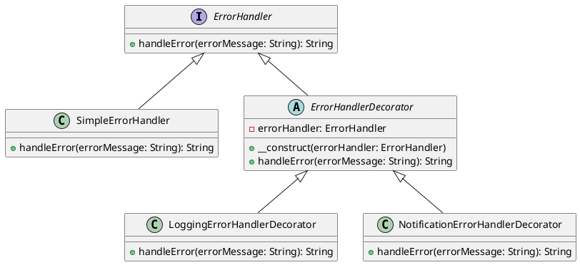

# PHP

Мы — команда разработчиков, работающая над веб-приложением для интернет-магазина. Наша цель — создать систему обработки ошибок, которая будет эффективно управлять различными ситуациями, такими как добавление товара в корзину, оформление заказа и другие операции. Мы хотим, чтобы наша система была гибкой и легко расширяемой, чтобы в будущем можно было добавлять новые типы обработки ошибок без изменения существующего кода.

#### Описание паттерна Декоратор

Паттерн Декоратор позволяет динамически добавлять новое поведение объектам, оборачивая их в объекты классов декораторов. Это особенно полезно, когда нужно добавить новые функциональности к объектам без изменения их кода.

#### Пример кода на PHP

**Базовый интерфейс и класс**


```php
<?php
// Базовый интерфейс для обработки ошибок
interface ErrorHandler {
    public function handleError(string $errorMessage): string;
}

// Базовый класс, реализующий интерфейс ErrorHandler
class SimpleErrorHandler implements ErrorHandler {
    public function handleError(string $errorMessage): string {
        return "Ошибка: " . $errorMessage;
    }
}
?>
```


**Декораторы**


```php
<?php
// Базовый класс декоратора
abstract class ErrorHandlerDecorator implements ErrorHandler {
    protected $errorHandler;

    public function __construct(ErrorHandler $errorHandler) {
        $this->errorHandler = $errorHandler;
    }

    public function handleError(string $errorMessage): string {
        return $this->errorHandler->handleError($errorMessage);
    }
}

// Декоратор для логирования ошибок
class LoggingErrorHandlerDecorator extends ErrorHandlerDecorator {
    public function handleError(string $errorMessage): string {
        // Логируем ошибку
        file_put_contents('error.log', $errorMessage . PHP_EOL, FILE_APPEND);
        // Передаем обработку ошибки дальше
        return $this->errorHandler->handleError($errorMessage);
    }
}

// Декоратор для отправки уведомлений об ошибках
class NotificationErrorHandlerDecorator extends ErrorHandlerDecorator {
    public function handleError(string $errorMessage): string {
        // Отправляем уведомление об ошибке
        echo "Уведомление: " . $errorMessage . PHP_EOL;
        // Передаем обработку ошибки дальше
        return $this->errorHandler->handleError($errorMessage);
    }
}
?>
```


**Использование декораторов**


```php
<?php
// Создаем базовый обработчик ошибок
$simpleErrorHandler = new SimpleErrorHandler();

// Оборачиваем его в декоратор для логирования
$loggingErrorHandler = new LoggingErrorHandlerDecorator($simpleErrorHandler);

// Оборачиваем его в декоратор для уведомлений
$notificationErrorHandler = new NotificationErrorHandlerDecorator($loggingErrorHandler);

// Обрабатываем ошибку
$errorMessage = "Не удалось добавить товар в корзину";
$result = $notificationErrorHandler->handleError($errorMessage);

echo $result;
?>
```


#### UML диаграмма

<figure><figcaption><p>UML диаграмма для паттерна "Декоратор"</p></figcaption></figure>





#### Вывод

Использование паттерна Декоратор позволяет нам гибко и легко добавлять новые функциональности для обработки ошибок без изменения существующего кода. В данном кейсе мы создали базовый обработчик ошибок и добавили к нему декораторы для логирования и отправки уведомлений. Это позволяет нам легко расширять систему в будущем, добавляя новые типы обработки ошибок.
