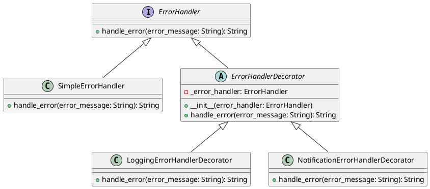

# Python

Мы — команда разработчиков, работающая над веб-приложением для интернет-магазина. Наша цель — создать систему обработки ошибок, которая будет эффективно управлять различными ситуациями, такими как добавление товара в корзину, оформление заказа и другие операции. Мы хотим, чтобы наша система была гибкой и легко расширяемой, чтобы в будущем можно было добавлять новые типы обработки ошибок без изменения существующего кода.

#### Описание паттерна Декоратор

Паттерн Декоратор позволяет динамически добавлять новое поведение объектам, оборачивая их в объекты классов декораторов. Это особенно полезно, когда нужно добавить новые функциональности к объектам без изменения их кода.

#### Пример кода на Python

**Базовый интерфейс и класс**


```python
# Базовый интерфейс для обработки ошибок
class ErrorHandler:
    def handle_error(self, error_message: str) -> str:
        pass

# Базовый класс, реализующий интерфейс ErrorHandler
class SimpleErrorHandler(ErrorHandler):
    def handle_error(self, error_message: str) -> str:
        return "Ошибка: " + error_message
```


**Декораторы**


```python
# Базовый класс декоратора
class ErrorHandlerDecorator(ErrorHandler):
    def __init__(self, error_handler: ErrorHandler):
        self._error_handler = error_handler

    def handle_error(self, error_message: str) -> str:
        return self._error_handler.handle_error(error_message)

# Декоратор для логирования ошибок
class LoggingErrorHandlerDecorator(ErrorHandlerDecorator):
    def handle_error(self, error_message: str) -> str:
        # Логируем ошибку
        with open('error.log', 'a') as file:
            file.write(error_message + '\n')
        # Передаем обработку ошибки дальше
        return self._error_handler.handle_error(error_message)

# Декоратор для отправки уведомлений об ошибках
class NotificationErrorHandlerDecorator(ErrorHandlerDecorator):
    def handle_error(self, error_message: str) -> str:
        # Отправляем уведомление об ошибке
        print("Уведомление:", error_message)
        # Передаем обработку ошибки дальше
        return self._error_handler.handle_error(error_message)
```


**Использование декораторов**


```python
def main():
    # Создаем базовый обработчик ошибок
    simple_error_handler = SimpleErrorHandler()

    # Оборачиваем его в декоратор для логирования
    logging_error_handler = LoggingErrorHandlerDecorator(simple_error_handler)

    # Оборачиваем его в декоратор для уведомлений
    notification_error_handler = NotificationErrorHandlerDecorator(logging_error_handler)

    # Обрабатываем ошибку
    error_message = "Не удалось добавить товар в корзину"
    result = notification_error_handler.handle_error(error_message)

    print(result)

if __name__ == "__main__":
    main()
```


#### UML диаграмма

<figure><figcaption><p>UML диаграмма для паттерна "Декоратор"</p></figcaption></figure>





#### Вывод

Использование паттерна Декоратор позволяет нам гибко и легко добавлять новые функциональности для обработки ошибок без изменения существующего кода. В данном кейсе мы создали базовый обработчик ошибок и добавили к нему декораторы для логирования и отправки уведомлений. Это позволяет нам легко расширять систему в будущем, добавляя новые типы обработки ошибок.
