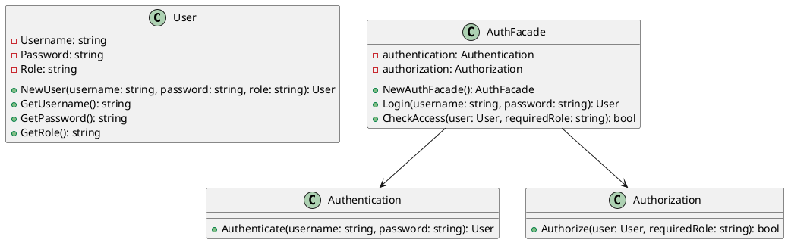

# Go

Представьте, что мы — команда разработчиков, работающая над веб-приложением. Наше приложение требует сложной системы аутентификации и авторизации. Мы должны управлять пользователями, их ролями, правами доступа и проверять их учетные данные. Все эти задачи выполняются разными классами и модулями, что делает систему сложной для понимания и использования.

Наша задача — упростить взаимодействие с системой аутентификации и авторизации, чтобы другие разработчики могли легко и быстро интегрировать эти функции в свои части приложения. Для этого мы решили использовать паттерн проектирования "Фасад" (Facade). Фасад предоставляет простой интерфейс для сложной системы классов, библиотек или фреймворков. В нашем случае, фасад будет предоставлять единый интерфейс для управления аутентификацией и авторизацией.

#### Пример кода на Go

**1. Классы для управления аутентификацией и авторизацией**


```go
package main

import "fmt"

// Класс для управления пользователями
type User struct {
    Username string
    Password string
    Role     string
}

func NewUser(username, password, role string) *User {
    return &User{
        Username: username,
        Password: password,
        Role:     role,
    }
}

func (u *User) GetUsername() string {
    return u.Username
}

func (u *User) GetPassword() string {
    return u.Password
}

func (u *User) GetRole() string {
    return u.Role
}

// Класс для аутентификации пользователей
type Authentication struct{}

func (a *Authentication) Authenticate(username, password string) *User {
    // Простая проверка аутентификации
    users := map[string]*User{
        "admin": NewUser("admin", "admin123", "admin"),
        "user":  NewUser("user", "user123", "user"),
    }

    if user, ok := users[username]; ok && user.GetPassword() == password {
        return user
    }

    return nil
}

// Класс для авторизации пользователей
type Authorization struct{}

func (a *Authorization) Authorize(user *User, requiredRole string) bool {
    return user.GetRole() == requiredRole
}
```


**2. Класс Фасада**


```go
// Класс Фасада для управления аутентификацией и авторизацией
type AuthFacade struct {
    authentication *Authentication
    authorization  *Authorization
}

func NewAuthFacade() *AuthFacade {
    return &AuthFacade{
        authentication: &Authentication{},
        authorization:  &Authorization{},
    }
}

// Метод для аутентификации пользователя
func (af *AuthFacade) Login(username, password string) *User {
    return af.authentication.Authenticate(username, password)
}

// Метод для авторизации пользователя
func (af *AuthFacade) CheckAccess(user *User, requiredRole string) bool {
    return af.authorization.Authorize(user, requiredRole)
}
```


**3. Использование Фасада**


```go
func main() {
    // Пример использования Фасада
    authFacade := NewAuthFacade()

    // Аутентификация пользователя
    user := authFacade.Login("admin", "admin123")
    if user != nil {
        fmt.Println("User authenticated:", user.GetUsername())

        // Авторизация пользователя
        if authFacade.CheckAccess(user, "admin") {
            fmt.Println("User has admin access.")
        } else {
            fmt.Println("User does not have admin access.")
        }
    } else {
        fmt.Println("Authentication failed.")
    }
}
```


#### UML диаграмма

<figure><figcaption><p>UML диаграмма для паттерна "Фасад"</p></figcaption></figure>





#### Вывод для кейса

Использование паттерна "Фасад" позволило нам создать простой и удобный интерфейс для управления аутентификацией и авторизацией в нашем приложении. Теперь другие разработчики могут легко интегрировать эти функции в свои части приложения, не вдаваясь в детали реализации каждого из классов. Это упрощает работу с системой аутентификации и авторизации и делает код более читаемым и поддерживаемым.
