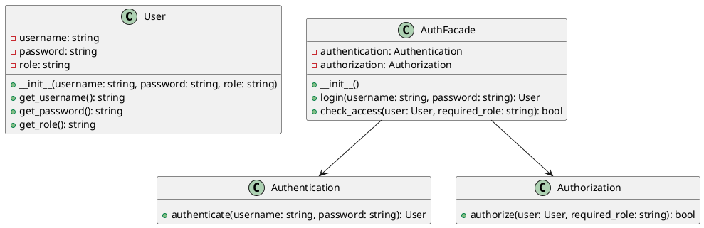

# Python

Представьте, что мы — команда разработчиков, работающая над веб-приложением. Наше приложение требует сложной системы аутентификации и авторизации. Мы должны управлять пользователями, их ролями, правами доступа и проверять их учетные данные. Все эти задачи выполняются разными классами и модулями, что делает систему сложной для понимания и использования.

Наша задача — упростить взаимодействие с системой аутентификации и авторизации, чтобы другие разработчики могли легко и быстро интегрировать эти функции в свои части приложения. Для этого мы решили использовать паттерн проектирования "Фасад" (Facade). Фасад предоставляет простой интерфейс для сложной системы классов, библиотек или фреймворков. В нашем случае, фасад будет предоставлять единый интерфейс для управления аутентификацией и авторизацией.

#### Пример кода на Python

**1. Классы для управления аутентификацией и авторизацией**


```python
# Класс для управления пользователями
class User:
    def __init__(self, username, password, role):
        self.username = username
        self.password = password
        self.role = role

    def get_username(self):
        return self.username

    def get_password(self):
        return self.password

    def get_role(self):
        return self.role

# Класс для аутентификации пользователей
class Authentication:
    def authenticate(self, username, password):
        # Простая проверка аутентификации
        users = {
            'admin': User('admin', 'admin123', 'admin'),
            'user': User('user', 'user123', 'user')
        }

        if username in users and users[username].get_password() == password:
            return users[username]

        return None

# Класс для авторизации пользователей
class Authorization:
    def authorize(self, user, required_role):
        return user.get_role() == required_role
```


**2. Класс Фасада**


```python
# Класс Фасада для управления аутентификацией и авторизацией
class AuthFacade:
    def __init__(self):
        self.authentication = Authentication()
        self.authorization = Authorization()

    # Метод для аутентификации пользователя
    def login(self, username, password):
        return self.authentication.authenticate(username, password)

    # Метод для авторизации пользователя
    def check_access(self, user, required_role):
        return self.authorization.authorize(user, required_role)
```


**3. Использование Фасада**


```python
# Пример использования Фасада
if __name__ == "__main__":
    auth_facade = AuthFacade()

    # Аутентификация пользователя
    user = auth_facade.login('admin', 'admin123')
    if user:
        print("User authenticated:", user.get_username())

        # Авторизация пользователя
        if auth_facade.check_access(user, 'admin'):
            print("User has admin access.")
        else:
            print("User does not have admin access.")
    else:
        print("Authentication failed.")
```


#### UML диаграмма

<figure><figcaption><p>UML диаграмма для паттерна "Фасад"</p></figcaption></figure>





#### Вывод для кейса

Использование паттерна "Фасад" позволило нам создать простой и удобный интерфейс для управления аутентификацией и авторизацией в нашем приложении. Теперь другие разработчики могут легко интегрировать эти функции в свои части приложения, не вдаваясь в детали реализации каждого из классов. Это упрощает работу с системой аутентификации и авторизации и делает код более читаемым и поддерживаемым.
