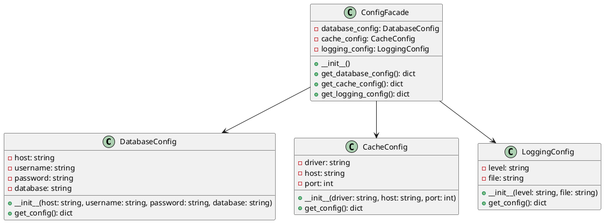

# Python

Представьте, что мы — команда разработчиков, работающая над веб-приложением. Наше приложение имеет множество настроек и конфигураций, таких как подключение к базе данных, настройки кэширования, параметры логирования и многое другое. Все эти настройки хранятся в разных местах и управляются разными классами. Наша задача — упростить управление этими конфигурациями, чтобы другие разработчики могли легко и быстро изменять настройки без необходимости понимать внутреннюю структуру приложения.

Для этого мы решили использовать паттерн проектирования "Фасад" (Facade). Фасад предоставляет простой интерфейс для сложной системы классов, библиотек или фреймворков. В нашем случае, фасад будет предоставлять единый интерфейс для управления всеми конфигурациями приложения.

#### Пример кода на Python

**1. Классы для управления конфигурациями**


```python
# Класс для управления настройками базы данных
class DatabaseConfig:
    def __init__(self, host, username, password, database):
        self.host = host
        self.username = username
        self.password = password
        self.database = database

    def get_config(self):
        return {
            'host': self.host,
            'username': self.username,
            'password': self.password,
            'database': self.database
        }

# Класс для управления настройками кэширования
class CacheConfig:
    def __init__(self, driver, host, port):
        self.driver = driver
        self.host = host
        self.port = port

    def get_config(self):
        return {
            'driver': self.driver,
            'host': self.host,
            'port': self.port
        }

# Класс для управления настройками логирования
class LoggingConfig:
    def __init__(self, level, file):
        self.level = level
        self.file = file

    def get_config(self):
        return {
            'level': self.level,
            'file': self.file
        }
```


**2. Класс Фасада**


```python
# Класс Фасада для управления всеми конфигурациями
class ConfigFacade:
    def __init__(self):
        # Инициализация конфигураций с дефолтными значениями
        self.database_config = DatabaseConfig('localhost', 'root', 'password', 'mydb')
        self.cache_config = CacheConfig('redis', 'localhost', 6379)
        self.logging_config = LoggingConfig('info', '/var/log/app.log')

    # Метод для получения конфигурации базы данных
    def get_database_config(self):
        return self.database_config.get_config()

    # Метод для получения конфигурации кэширования
    def get_cache_config(self):
        return self.cache_config.get_config()

    # Метод для получения конфигурации логирования
    def get_logging_config(self):
        return self.logging_config.get_config()
```


**3. Использование Фасада**


```python
# Пример использования Фасада
if __name__ == "__main__":
    config_facade = ConfigFacade()

    # Получение конфигурации базы данных
    db_config = config_facade.get_database_config()
    print("Database Config:", db_config)

    # Получение конфигурации кэширования
    cache_config = config_facade.get_cache_config()
    print("Cache Config:", cache_config)

    # Получение конфигурации логирования
    logging_config = config_facade.get_logging_config()
    print("Logging Config:", logging_config)
```


#### UML диаграмма

<figure><figcaption><p>UML диаграмма для паттерна "Фасад"</p></figcaption></figure>





#### Вывод для кейса

Использование паттерна "Фасад" позволило нам создать простой и удобный интерфейс для управления конфигурациями нашего приложения. Теперь другие разработчики могут легко получать и изменять настройки, не вдаваясь в детали реализации каждого из классов. Это упрощает работу с конфигурацией и делает код более читаемым и поддерживаемым.
