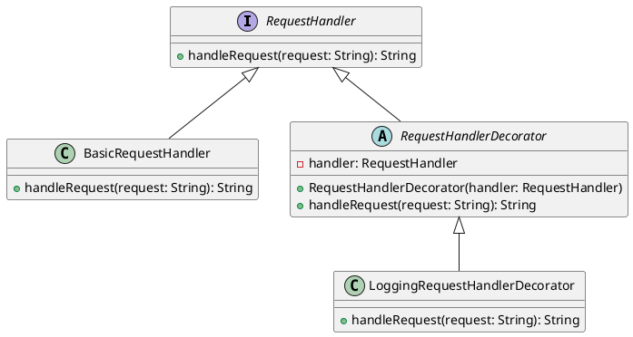

# PHP

Представьте, что мы работаем в компании, которая разрабатывает веб-приложения. Наша задача — реализовать систему логирования запросов, чтобы мы могли отслеживать, какие запросы приходят к нашему серверу, и как они обрабатываются. Это поможет нам в отладке и мониторинге.

#### Описание паттерна Декоратор

Паттерн Декоратор позволяет динамически добавлять новое поведение объекту, оборачивая его в объект класса декоратора. Это особенно полезно, когда мы хотим расширить функциональность объекта без изменения его кода.

#### Пример кода на PHP

**1. Базовый интерфейс**


```php
<?php
interface RequestHandler {
    public function handleRequest(string $request): string;
}
```


**2. Базовый класс обработки запросов**


```php
class BasicRequestHandler implements RequestHandler {
    public function handleRequest(string $request): string {
        // Логика обработки запроса
        return "Обработанный запрос: $request";
    }
}
```


**3. Базовый класс декоратора**


```php
abstract class RequestHandlerDecorator implements RequestHandler {
    protected $handler;

    public function __construct(RequestHandler $handler) {
        $this->handler = $handler;
    }

    public function handleRequest(string $request): string {
        return $this->handler->handleRequest($request);
    }
}
```


**4. Декоратор для логирования**


```php
class LoggingRequestHandlerDecorator extends RequestHandlerDecorator {
    public function handleRequest(string $request): string {
        // Логирование запроса перед обработкой
        echo "Логирование запроса: $request\n";

        // Обработка запроса
        $result = $this->handler->handleRequest($request);

        // Логирование результата после обработки
        echo "Логирование результата: $result\n";

        return $result;
    }
}
```


**5. Пример использования**

```php
$basicHandler = new BasicRequestHandler();
$loggingHandler = new LoggingRequestHandlerDecorator($basicHandler);

$request = "GET /api/data";
$result = $loggingHandler->handleRequest($request);

echo $result;
```

#### Объяснение кода

1. **Базовый интерфейс `RequestHandler`**: Определяет метод `handleRequest`, который будет реализован в конкретных классах.
2. **Базовый класс `BasicRequestHandler`**: Реализует интерфейс `RequestHandler` и содержит базовую логику обработки запросов.
3. **Базовый класс декоратора `RequestHandlerDecorator`**: Абстрактный класс, который реализует интерфейс `RequestHandler` и принимает объект `RequestHandler` в конструкторе.
4. **Декоратор для логирования `LoggingRequestHandlerDecorator`**: Наследует `RequestHandlerDecorator` и добавляет логирование перед и после обработки запроса.
5. **Пример использования**: Создаем объект базового обработчика и оборачиваем его в декоратор для логирования. Затем вызываем метод `handleRequest` и выводим результат.

#### UML диаграмма

<figure><figcaption><p>UML диаграмма для паттерна "Декоратор"</p></figcaption></figure>





#### Вывод

Паттерн Декоратор позволяет гибко расширять функциональность объектов без изменения их кода. В нашем кейсе мы использовали этот паттерн для добавления логирования к обработке запросов. Это позволяет нам легко добавлять или убирать логирование, не изменяя основной код обработки запросов. Такой подход делает систему более гибкой и удобной для поддержки.
