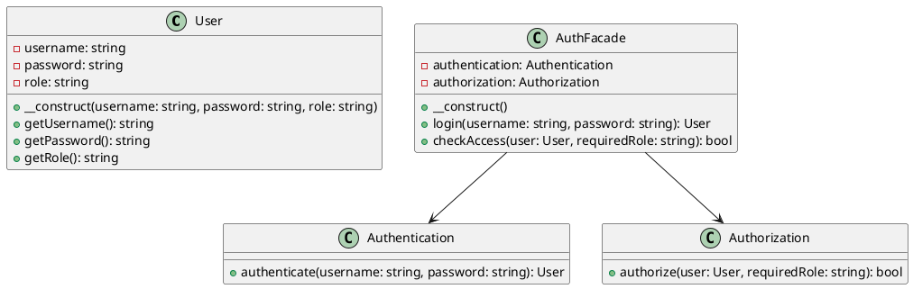

# PHP

Представьте, что мы — команда разработчиков, работающая над веб-приложением. Наше приложение требует сложной системы аутентификации и авторизации. Мы должны управлять пользователями, их ролями, правами доступа и проверять их учетные данные. Все эти задачи выполняются разными классами и модулями, что делает систему сложной для понимания и использования.

Наша задача — упростить взаимодействие с системой аутентификации и авторизации, чтобы другие разработчики могли легко и быстро интегрировать эти функции в свои части приложения. Для этого мы решили использовать паттерн проектирования "Фасад" (Facade). Фасад предоставляет простой интерфейс для сложной системы классов, библиотек или фреймворков. В нашем случае, фасад будет предоставлять единый интерфейс для управления аутентификацией и авторизацией.

#### Пример кода на PHP

**1. Классы для управления аутентификацией и авторизацией**


```php
// Класс для управления пользователями
class User {
    private $username;
    private $password;
    private $role;

    public function __construct($username, $password, $role) {
        $this->username = $username;
        $this->password = $password;
        $this->role = $role;
    }

    public function getUsername() {
        return $this->username;
    }

    public function getPassword() {
        return $this->password;
    }

    public function getRole() {
        return $this->role;
    }
}

// Класс для аутентификации пользователей
class Authentication {
    public function authenticate($username, $password) {
        // Простая проверка аутентификации
        $users = [
            'admin' => new User('admin', 'admin123', 'admin'),
            'user' => new User('user', 'user123', 'user')
        ];

        if (isset($users[$username]) && $users[$username]->getPassword() === $password) {
            return $users[$username];
        }

        return null;
    }
}

// Класс для авторизации пользователей
class Authorization {
    public function authorize($user, $requiredRole) {
        return $user->getRole() === $requiredRole;
    }
}
```


**2. Класс Фасада**


```php
// Класс Фасада для управления аутентификацией и авторизацией
class AuthFacade {
    private $authentication;
    private $authorization;

    public function __construct() {
        $this->authentication = new Authentication();
        $this->authorization = new Authorization();
    }

    // Метод для аутентификации пользователя
    public function login($username, $password) {
        $user = $this->authentication->authenticate($username, $password);
        if ($user) {
            return $user;
        }
        return null;
    }

    // Метод для авторизации пользователя
    public function checkAccess($user, $requiredRole) {
        return $this->authorization->authorize($user, $requiredRole);
    }
}
```


**3. Использование Фасада**


```php
// Пример использования Фасада
$authFacade = new AuthFacade();

// Аутентификация пользователя
$user = $authFacade->login('admin', 'admin123');
if ($user) {
    echo "User authenticated: " . $user->getUsername() . "\n";

    // Авторизация пользователя
    if ($authFacade->checkAccess($user, 'admin')) {
        echo "User has admin access.\n";
    } else {
        echo "User does not have admin access.\n";
    }
} else {
    echo "Authentication failed.\n";
}
```


#### UML диаграмма





#### Вывод для кейса

Использование паттерна "Фасад" позволило нам создать простой и удобный интерфейс для управления аутентификацией и авторизацией в нашем приложении. Теперь другие разработчики могут легко интегрировать эти функции в свои части приложения, не вдаваясь в детали реализации каждого из классов. Это упрощает работу с системой аутентификации и авторизации и делает код более читаемым и поддерживаемым.
