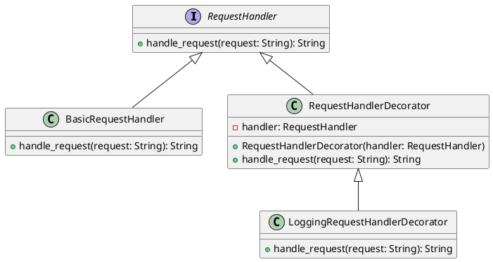

# Python

Представьте, что мы работаем в компании, которая разрабатывает веб-приложения. Наша задача — реализовать систему логирования запросов, чтобы мы могли отслеживать, какие запросы приходят к нашему серверу, и как они обрабатываются. Это поможет нам в отладке и мониторинге.

#### Описание паттерна Декоратор

Паттерн Декоратор позволяет динамически добавлять новое поведение объекту, оборачивая его в объект класса декоратора. Это особенно полезно, когда мы хотим расширить функциональность объекта без изменения его кода.

#### Пример кода на Python

**1. Базовый интерфейс**


```python
from abc import ABC, abstractmethod

class RequestHandler(ABC):
    @abstractmethod
    def handle_request(self, request: str) -> str:
        pass
```


**2. Базовый класс обработки запросов**


```python
class BasicRequestHandler(RequestHandler):
    def handle_request(self, request: str) -> str:
        # Логика обработки запроса
        return f"Обработанный запрос: {request}"
```


**3. Базовый класс декоратора**


```python
class RequestHandlerDecorator(RequestHandler):
    def __init__(self, handler: RequestHandler):
        self._handler = handler

    def handle_request(self, request: str) -> str:
        return self._handler.handle_request(request)
```


**4. Декоратор для логирования**


```python
class LoggingRequestHandlerDecorator(RequestHandlerDecorator):
    def handle_request(self, request: str) -> str:
        # Логирование запроса перед обработкой
        print(f"Логирование запроса: {request}")

        # Обработка запроса
        result = self._handler.handle_request(request)

        # Логирование результата после обработки
        print(f"Логирование результата: {result}")

        return result
```


**5. Пример использования**


```python
if __name__ == "__main__":
    basic_handler = BasicRequestHandler()
    logging_handler = LoggingRequestHandlerDecorator(basic_handler)

    request = "GET /api/data"
    result = logging_handler.handle_request(request)

    print(result)
```


#### Объяснение кода

1. **Базовый интерфейс `RequestHandler`**: Определяет метод `handle_request`, который будет реализован в конкретных классах.
2. **Базовый класс `BasicRequestHandler`**: Реализует интерфейс `RequestHandler` и содержит базовую логику обработки запросов.
3. **Базовый класс декоратора `RequestHandlerDecorator`**: Класс, который реализует интерфейс `RequestHandler` и принимает объект `RequestHandler` в конструкторе.
4. **Декоратор для логирования `LoggingRequestHandlerDecorator`**: Наследует `RequestHandlerDecorator` и добавляет логирование перед и после обработки запроса.
5. **Пример использования**: Создаем объект базового обработчика и оборачиваем его в декоратор для логирования. Затем вызываем метод `handle_request` и выводим результат.

#### UML диаграмма

<figure><figcaption><p>UML диаграмма для паттерна "Декоратор"</p></figcaption></figure>



#### Вывод

Паттерн Декоратор позволяет гибко расширять функциональность объектов без изменения их кода. В нашем кейсе мы использовали этот паттерн для добавления логирования к обработке запросов. Это позволяет нам легко добавлять или убирать логирование, не изменяя основной код обработки запросов. Такой подход делает систему более гибкой и удобной для поддержки.
