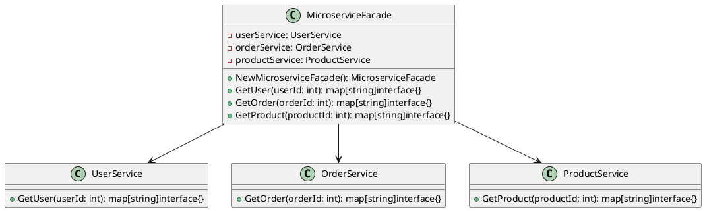

# Go

Представьте, что мы — команда разработчиков, работающая над сложным веб-приложением, которое взаимодействует с несколькими микросервисами. Наше приложение должно отправлять запросы к различным микросервисам для получения данных, обработки заказов, управления пользователями и других задач. Каждый микросервис имеет свой собственный API и способ взаимодействия, что делает систему сложной для понимания и использования.

Наша задача — упростить взаимодействие с микросервисами, чтобы другие разработчики могли легко и быстро интегрировать эти функции в свои части приложения. Для этого мы решили использовать паттерн проектирования "Фасад" (Facade). Фасад предоставляет простой интерфейс для сложной системы классов, библиотек или фреймворков. В нашем случае, фасад будет предоставлять единый интерфейс для взаимодействия с микросервисами.

#### Пример кода на Go

**1. Классы для взаимодействия с микросервисами**


```go
package main

import "fmt"

// Класс для взаимодействия с микросервисом пользователей
type UserService struct{}

func (us *UserService) GetUser(userId int) map[string]interface{} {
    // Логика для получения данных пользователя из микросервиса
    return map[string]interface{}{
        "id":    userId,
        "name":  "John Doe",
        "email": "john.doe@example.com",
    }
}

// Класс для взаимодействия с микросервисом заказов
type OrderService struct{}

func (os *OrderService) GetOrder(orderId int) map[string]interface{} {
    // Логика для получения данных заказа из микросервиса
    return map[string]interface{}{
        "id":     orderId,
        "status": "completed",
        "total":  100.00,
    }
}

// Класс для взаимодействия с микросервисом продуктов
type ProductService struct{}

func (ps *ProductService) GetProduct(productId int) map[string]interface{} {
    // Логика для получения данных продукта из микросервиса
    return map[string]interface{}{
        "id":    productId,
        "name":  "Product Name",
        "price": 50.00,
    }
}
```


**2. Класс Фасада**


```go
// Класс Фасада для взаимодействия с микросервисами
type MicroserviceFacade struct {
    userService   *UserService
    orderService  *OrderService
    productService *ProductService
}

func NewMicroserviceFacade() *MicroserviceFacade {
    return &MicroserviceFacade{
        userService:   &UserService{},
        orderService:  &OrderService{},
        productService: &ProductService{},
    }
}

// Метод для получения данных пользователя
func (mf *MicroserviceFacade) GetUser(userId int) map[string]interface{} {
    return mf.userService.GetUser(userId)
}

// Метод для получения данных заказа
func (mf *MicroserviceFacade) GetOrder(orderId int) map[string]interface{} {
    return mf.orderService.GetOrder(orderId)
}

// Метод для получения данных продукта
func (mf *MicroserviceFacade) GetProduct(productId int) map[string]interface{} {
    return mf.productService.GetProduct(productId)
}
```


**3. Использование Фасада**


```go
func main() {
    // Пример использования Фасада
    microserviceFacade := NewMicroserviceFacade()

    // Получение данных пользователя
    user := microserviceFacade.GetUser(1)
    fmt.Println("User:", user)

    // Получение данных заказа
    order := microserviceFacade.GetOrder(1)
    fmt.Println("Order:", order)

    // Получение данных продукта
    product := microserviceFacade.GetProduct(1)
    fmt.Println("Product:", product)
}
```


#### UML диаграмма

<figure><figcaption><p>UML диаграмма для паттерна "Фасад"</p></figcaption></figure>





#### Вывод для кейса

Использование паттерна "Фасад" позволило нам создать простой и удобный интерфейс для взаимодействия с микросервисами в нашем приложении. Теперь другие разработчики могут легко интегрировать эти функции в свои части приложения, не вдаваясь в детали реализации каждого из микросервисов. Это упрощает работу с системой микросервисов и делает код более читаемым и поддерживаемым.
