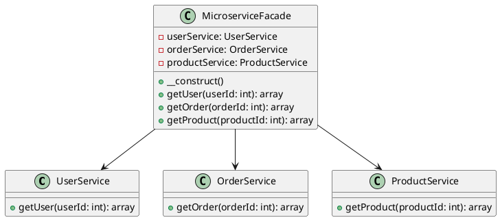

# PHP

Представьте, что мы — команда разработчиков, работающая над сложным веб-приложением, которое взаимодействует с несколькими микросервисами. Наше приложение должно отправлять запросы к различным микросервисам для получения данных, обработки заказов, управления пользователями и других задач. Каждый микросервис имеет свой собственный API и способ взаимодействия, что делает систему сложной для понимания и использования.

Наша задача — упростить взаимодействие с микросервисами, чтобы другие разработчики могли легко и быстро интегрировать эти функции в свои части приложения. Для этого мы решили использовать паттерн проектирования "Фасад" (Facade). Фасад предоставляет простой интерфейс для сложной системы классов, библиотек или фреймворков. В нашем случае, фасад будет предоставлять единый интерфейс для взаимодействия с микросервисами.

#### Пример кода на PHP

**1. Классы для взаимодействия с микросервисами**


```php
// Класс для взаимодействия с микросервисом пользователей
class UserService {
    public function getUser($userId) {
        // Логика для получения данных пользователя из микросервиса
        return [
            'id' => $userId,
            'name' => 'John Doe',
            'email' => 'john.doe@example.com'
        ];
    }
}

// Класс для взаимодействия с микросервисом заказов
class OrderService {
    public function getOrder($orderId) {
        // Логика для получения данных заказа из микросервиса
        return [
            'id' => $orderId,
            'status' => 'completed',
            'total' => 100.00
        ];
    }
}

// Класс для взаимодействия с микросервисом продуктов
class ProductService {
    public function getProduct($productId) {
        // Логика для получения данных продукта из микросервиса
        return [
            'id' => $productId,
            'name' => 'Product Name',
            'price' => 50.00
        ];
    }
}
```


**2. Класс Фасада**


```php
// Класс Фасада для взаимодействия с микросервисами
class MicroserviceFacade {
    private $userService;
    private $orderService;
    private $productService;

    public function __construct() {
        $this->userService = new UserService();
        $this->orderService = new OrderService();
        $this->productService = new ProductService();
    }

    // Метод для получения данных пользователя
    public function getUser($userId) {
        return $this->userService->getUser($userId);
    }

    // Метод для получения данных заказа
    public function getOrder($orderId) {
        return $this->orderService->getOrder($orderId);
    }

    // Метод для получения данных продукта
    public function getProduct($productId) {
        return $this->productService->getProduct($productId);
    }
}
```


**3. Использование Фасада**


```php
// Пример использования Фасада
$microserviceFacade = new MicroserviceFacade();

// Получение данных пользователя
$user = $microserviceFacade->getUser(1);
print_r($user);

// Получение данных заказа
$order = $microserviceFacade->getOrder(1);
print_r($order);

// Получение данных продукта
$product = $microserviceFacade->getProduct(1);
print_r($product);
```


#### UML диаграмма

<figure><figcaption><p>UML диаграмма для паттерна "Фасад"</p></figcaption></figure>





#### Вывод для кейса

Использование паттерна "Фасад" позволило нам создать простой и удобный интерфейс для взаимодействия с микросервисами в нашем приложении. Теперь другие разработчики могут легко интегрировать эти функции в свои части приложения, не вдаваясь в детали реализации каждого из микросервисов. Это упрощает работу с системой микросервисов и делает код более читаемым и поддерживаемым.

09:01∙Mistral Large 2АО\
