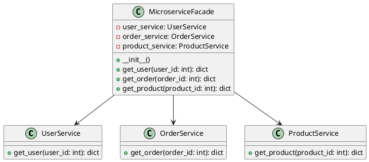

# Python

Представьте, что мы — команда разработчиков, работающая над сложным веб-приложением, которое взаимодействует с несколькими микросервисами. Наше приложение должно отправлять запросы к различным микросервисам для получения данных, обработки заказов, управления пользователями и других задач. Каждый микросервис имеет свой собственный API и способ взаимодействия, что делает систему сложной для понимания и использования.

Наша задача — упростить взаимодействие с микросервисами, чтобы другие разработчики могли легко и быстро интегрировать эти функции в свои части приложения. Для этого мы решили использовать паттерн проектирования "Фасад" (Facade). Фасад предоставляет простой интерфейс для сложной системы классов, библиотек или фреймворков. В нашем случае, фасад будет предоставлять единый интерфейс для взаимодействия с микросервисами.

#### Пример кода на Python

**1. Классы для взаимодействия с микросервисами**


```python
# Класс для взаимодействия с микросервисом пользователей
class UserService:
    def get_user(self, user_id):
        # Логика для получения данных пользователя из микросервиса
        return {
            'id': user_id,
            'name': 'John Doe',
            'email': 'john.doe@example.com'
        }

# Класс для взаимодействия с микросервисом заказов
class OrderService:
    def get_order(self, order_id):
        # Логика для получения данных заказа из микросервиса
        return {
            'id': order_id,
            'status': 'completed',
            'total': 100.00
        }

# Класс для взаимодействия с микросервисом продуктов
class ProductService:
    def get_product(self, product_id):
        # Логика для получения данных продукта из микросервиса
        return {
            'id': product_id,
            'name': 'Product Name',
            'price': 50.00
        }
```


**2. Класс Фасада**


```python
# Класс Фасада для взаимодействия с микросервисами
class MicroserviceFacade:
    def __init__(self):
        self.user_service = UserService()
        self.order_service = OrderService()
        self.product_service = ProductService()

    # Метод для получения данных пользователя
    def get_user(self, user_id):
        return self.user_service.get_user(user_id)

    # Метод для получения данных заказа
    def get_order(self, order_id):
        return self.order_service.get_order(order_id)

    # Метод для получения данных продукта
    def get_product(self, product_id):
        return self.product_service.get_product(product_id)
```


**3. Использование Фасада**


```python
# Пример использования Фасада
if __name__ == "__main__":
    microservice_facade = MicroserviceFacade()

    # Получение данных пользователя
    user = microservice_facade.get_user(1)
    print("User:", user)

    # Получение данных заказа
    order = microservice_facade.get_order(1)
    print("Order:", order)

    # Получение данных продукта
    product = microservice_facade.get_product(1)
    print("Product:", product)
```


#### UML диаграмма

<figure><figcaption><p>UML диаграмма для паттерна "Фасад"</p></figcaption></figure>





#### Вывод для кейса

Использование паттерна "Фасад" позволило нам создать простой и удобный интерфейс для взаимодействия с микросервисами в нашем приложении. Теперь другие разработчики могут легко интегрировать эти функции в свои части приложения, не вдаваясь в детали реализации каждого из микросервисов. Это упрощает работу с системой микросервисов и делает код более читаемым и поддерживаемым.
