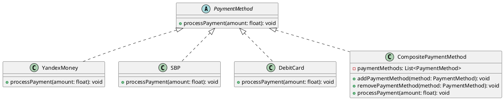

# PHP

Давайте рассмотрим кейс применения паттерна ООП Компоновщик на примере разработки системы платежей. В этом кейсе мы будем использовать три платежные системы: Яндекс Деньги, СБП и Дебетовую карту.

#### Описание паттерна Компоновщик

Паттерн Компоновщик позволяет клиентам обращаться к отдельным объектам и к композициям объектов одинаково. Это полезно, когда у вас есть иерархия объектов, и вы хотите обрабатывать их единообразно.

#### UML диаграмма

<figure><figcaption><p>UML диаграмма для паттерна "Компоновщик"</p></figcaption></figure>





#### Пример кода на PHP

**1. Абстрактный класс PaymentMethod**


```php
<?php
abstract class PaymentMethod {
    abstract public function processPayment(float $amount): void;
}
?>
```


**2. Класс YandexMoney**


```php
<?php
class YandexMoney extends PaymentMethod {
    public function processPayment(float $amount): void {
        echo "Обработка платежа через Яндекс Деньги на сумму $amount\n";
    }
}
?>
```


**3. Класс SBP**


```php
<?php
class SBP extends PaymentMethod {
    public function processPayment(float $amount): void {
        echo "Обработка платежа через СБП на сумму $amount\n";
    }
}
?>
```


**4. Класс DebitCard**


```php
<?php
class DebitCard extends PaymentMethod {
    public function processPayment(float $amount): void {
        echo "Обработка платежа через Дебетовую карту на сумму $amount\n";
    }
}
?>
```


**5. Класс CompositePaymentMethod**


```php
<?php
class CompositePaymentMethod extends PaymentMethod {
    private $paymentMethods = [];

    public function addPaymentMethod(PaymentMethod $method): void {
        $this->paymentMethods[] = $method;
    }

    public function removePaymentMethod(PaymentMethod $method): void {
        $index = array_search($method, $this->paymentMethods);
        if ($index !== false) {
            unset($this->paymentMethods[$index]);
        }
    }

    public function processPayment(float $amount): void {
        foreach ($this->paymentMethods as $method) {
            $method->processPayment($amount);
        }
    }
}
?>
```


**6. Пример использования**


```php
<?php
// Создаем объекты платежных методов
$yandexMoney = new YandexMoney();
$sbp = new SBP();
$debitCard = new DebitCard();

// Создаем композитный платежный метод
$compositePayment = new CompositePaymentMethod();
$compositePayment->addPaymentMethod($yandexMoney);
$compositePayment->addPaymentMethod($sbp);
$compositePayment->addPaymentMethod($debitCard);

// Обрабатываем платеж через композитный метод
$compositePayment->processPayment(100.0);
?>
```


#### Объяснение кода

1. **Абстрактный класс PaymentMethod**: Это базовый класс для всех платежных методов. Он содержит абстрактный метод `processPayment`, который должен быть реализован в подклассах.
2. **Классы YandexMoney, SBP и DebitCard**: Эти классы реализуют метод `processPayment` для обработки платежей через соответствующие платежные системы.
3. **Класс CompositePaymentMethod**: Этот класс позволяет объединять несколько платежных методов в один композитный метод. Он содержит массив `paymentMethods`, в который можно добавлять и удалять платежные методы. Метод `processPayment` вызывает метод `processPayment` для каждого из добавленных платежных методов.
4. **Пример использования**: Мы создаем объекты для каждого платежного метода, добавляем их в композитный платежный метод и вызываем метод `processPayment` для обработки платежа через все добавленные методы.


```plant-uml
@startuml
abstract class PaymentMethod {
    +processPayment(amount: float): void
}

class YandexMoney implements PaymentMethod {
    +processPayment(amount: float): void
}

class SBP implements PaymentMethod {
    +processPayment(amount: float): void
}

class DebitCard implements PaymentMethod {
    +processPayment(amount: float): void
}

class CompositePaymentMethod implements PaymentMethod {
    -paymentMethods: List<PaymentMethod>
    +addPaymentMethod(method: PaymentMethod): void
    +removePaymentMethod(method: PaymentMethod): void
    +processPayment(amount: float): void
}
@enduml

```


Таким образом, паттерн Компоновщик позволяет нам обрабатывать платежи через разные платежные системы единообразно, что упрощает управление и расширение системы платежей.
