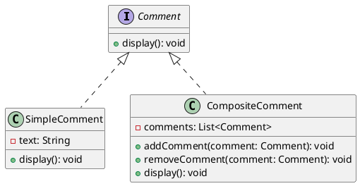

# PHP

Мы — команда разработчиков, работающая над созданием системы управления комментариями для веб-сайта. Наша цель — предоставить пользователям возможность оставлять комментарии и ответы на комментарии. Для этого мы используем паттерн Компоновщик, который позволяет нам обрабатывать комментарии и ответы единообразно.

#### UML диаграмма






**1. Интерфейс Comment**


```php
<?php
interface Comment {
    public function display();
}
?>
```


**2. Класс SimpleComment**


```php
<?php
class SimpleComment implements Comment {
    private $text;

    public function __construct($text) {
        $this->text = $text;
    }

    public function display() {
        echo "Комментарий: " . $this->text . "\n";
    }
}
?>
```


**3. Класс CompositeComment**


```php
<?php
class CompositeComment implements Comment {
    private $comments = [];

    public function addComment(Comment $comment) {
        $this->comments[] = $comment;
    }

    public function removeComment(Comment $comment) {
        $index = array_search($comment, $this->comments);
        if ($index !== false) {
            unset($this->comments[$index]);
        }
    }

    public function display() {
        foreach ($this->comments as $comment) {
            $comment->display();
        }
    }
}
?>
```


**4. Пример использования**


```php
<?php
function main() {
    // Создаем простые комментарии
    $comment1 = new SimpleComment("Это первый комментарий.");
    $comment2 = new SimpleComment("Это второй комментарий.");

    // Создаем композитный комментарий
    $compositeComment = new CompositeComment();
    $compositeComment->addComment($comment1);
    $compositeComment->addComment($comment2);

    // Создаем вложенные комментарии
    $subComment1 = new SimpleComment("Это ответ на первый комментарий.");
    $subComment2 = new SimpleComment("Это ответ на второй комментарий.");

    // Добавляем вложенные комментарии в композитный комментарий
    $compositeComment->addComment($subComment1);
    $compositeComment->addComment($subComment2);

    // Отображаем все комментарии
    $compositeComment->display();
}

main();
?>
```


#### Объяснение кода

1.  **Интерфейс Comment**: Это базовый интерфейс для всех комментариев. Он содержит метод `display`, который должен быть реализован в подклассах.

    ```php
    interface Comment {
        public function display();
    }
    ```
2.  **Класс SimpleComment**: Этот класс представляет простой комментарий. Он содержит текст комментария и реализует метод `display`, который отображает текст комментария.

    
    ```php
    class SimpleComment implements Comment {
        private $text;

        public function __construct($text) {
            $this->text = $text;
        }

        public function display() {
            echo "Комментарий: " . $this->text . "\n";
        }
    }
    ```
    
3.  **Класс CompositeComment**: Этот класс представляет композитный комментарий, который может содержать другие комментарии и ответы. Он содержит массив `comments`, в который можно добавлять и удалять комментарии. Метод `display` вызывает метод `display` для каждого из добавленных комментариев.

    
    ```php
    class CompositeComment implements Comment {
        private $comments = [];

        public function addComment(Comment $comment) {
            $this->comments[] = $comment;
        }

        public function removeComment(Comment $comment) {
            $index = array_search($comment, $this->comments);
            if ($index !== false) {
                unset($this->comments[$index]);
            }
        }

        public function display() {
            foreach ($this->comments as $comment) {
                $comment->display();
            }
        }
    }
    ```
    
4.  **Пример использования**: Мы создаем простые комментарии и композитный комментарий. Затем добавляем простые комментарии и вложенные комментарии в композитный комментарий и вызываем метод `display` для отображения всех комментариев.

    
    ```php
    function main() {
        // Создаем простые комментарии
        $comment1 = new SimpleComment("Это первый комментарий.");
        $comment2 = new SimpleComment("Это второй комментарий.");

        // Создаем композитный комментарий
        $compositeComment = new CompositeComment();
        $compositeComment->addComment($comment1);
        $compositeComment->addComment($comment2);

        // Создаем вложенные комментарии
        $subComment1 = new SimpleComment("Это ответ на первый комментарий.");
        $subComment2 = new SimpleComment("Это ответ на второй комментарий.");

        // Добавляем вложенные комментарии в композитный комментарий
        $compositeComment->addComment($subComment1);
        $compositeComment->addComment($subComment2);

        // Отображаем все комментарии
        $compositeComment->display();
    }

    main();
    ```
    

Таким образом, паттерн Компоновщик позволяет нам обрабатывать комментарии и ответы единообразно, что упрощает управление и расширение системы управления комментариями.
