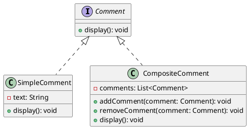

# Python

Мы — команда разработчиков, работающая над созданием системы управления комментариями для веб-сайта. Наша цель — предоставить пользователям возможность оставлять комментарии и ответы на комментарии. Для этого мы используем паттерн Компоновщик, который позволяет нам обрабатывать комментарии и ответы единообразно.

#### UML диаграмма

<figure><figcaption><p>UML диаграмма для паттерна "Компоновщик"</p></figcaption></figure>





#### Пример кода на Python

**1. Интерфейс Comment**


```python
from abc import ABC, abstractmethod

class Comment(ABC):
    @abstractmethod
    def display(self):
        pass
```


**2. Класс SimpleComment**


```python
class SimpleComment(Comment):
    def __init__(self, text):
        self.text = text

    def display(self):
        print(f"Комментарий: {self.text}")
```


**3. Класс CompositeComment**


```python
class CompositeComment(Comment):
    def __init__(self):
        self.comments = []

    def addComment(self, comment):
        self.comments.append(comment)

    def removeComment(self, comment):
        self.comments.remove(comment)

    def display(self):
        for comment in self.comments:
            comment.display()
```


**4. Пример использования**


```python
def main():
    # Создаем простые комментарии
    comment1 = SimpleComment("Это первый комментарий.")
    comment2 = SimpleComment("Это второй комментарий.")

    # Создаем композитный комментарий
    compositeComment = CompositeComment()
    compositeComment.addComment(comment1)
    compositeComment.addComment(comment2)

    # Создаем вложенные комментарии
    subComment1 = SimpleComment("Это ответ на первый комментарий.")
    subComment2 = SimpleComment("Это ответ на второй комментарий.")

    # Добавляем вложенные комментарии в композитный комментарий
    compositeComment.addComment(subComment1)
    compositeComment.addComment(subComment2)

    # Отображаем все комментарии
    compositeComment.display()

if __name__ == "__main__":
    main()
```


#### Объяснение кода

1.  **Интерфейс Comment**: Это базовый интерфейс для всех комментариев. Он содержит абстрактный метод `display`, который должен быть реализован в подклассах.

    
    ```python
    from abc import ABC, abstractmethod

    class Comment(ABC):
        @abstractmethod
        def display(self):
            pass
    ```
    
2.  **Класс SimpleComment**: Этот класс представляет простой комментарий. Он содержит текст комментария и реализует метод `display`, который отображает текст комментария.

    
    ```python
    class SimpleComment(Comment):
        def __init__(self, text):
            self.text = text

        def display(self):
            print(f"Комментарий: {self.text}")
    ```
    
3.  **Класс CompositeComment**: Этот класс представляет композитный комментарий, который может содержать другие комментарии и ответы. Он содержит список `comments`, в который можно добавлять и удалять комментарии. Метод `display` вызывает метод `display` для каждого из добавленных комментариев.

    
    ```python
    class CompositeComment(Comment):
        def __init__(self):
            self.comments = []

        def addComment(self, comment):
            self.comments.append(comment)

        def removeComment(self, comment):
            self.comments.remove(comment)

        def display(self):
            for comment in self.comments:
                comment.display()
    ```
    
4.  **Пример использования**: Мы создаем простые комментарии и композитный комментарий. Затем добавляем простые комментарии и вложенные комментарии в композитный комментарий и вызываем метод `display` для отображения всех комментариев.

    
    ```python
    def main():
        # Создаем простые комментарии
        comment1 = SimpleComment("Это первый комментарий.")
        comment2 = SimpleComment("Это второй комментарий.")

        # Создаем композитный комментарий
        compositeComment = CompositeComment()
        compositeComment.addComment(comment1)
        compositeComment.addComment(comment2)

        # Создаем вложенные комментарии
        subComment1 = SimpleComment("Это ответ на первый комментарий.")
        subComment2 = SimpleComment("Это ответ на второй комментарий.")

        # Добавляем вложенные комментарии в композитный комментарий
        compositeComment.addComment(subComment1)
        compositeComment.addComment(subComment2)

        # Отображаем все комментарии
        compositeComment.display()

    if __name__ == "__main__":
        main()
    ```
    

Таким образом, паттерн Компоновщик позволяет нам обрабатывать комментарии и ответы единообразно, что упрощает управление и расширение системы управления комментариями.
