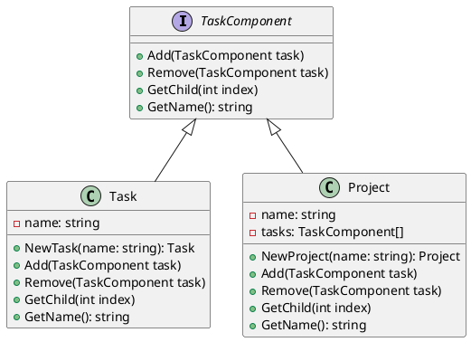

# Go

Представьте, что мы — команда разработчиков, работающая над системой управления задачами. Наша цель — создать гибкую и расширяемую систему, которая позволит пользователям создавать задачи, подзадачи и группировать их в проекты. Для этого мы решили использовать паттерн проектирования "Компоновщик" (Composite), который позволяет нам обрабатывать объекты и их композиции единообразно.

#### Описание паттерна Компоновщик

Паттерн Компоновщик позволяет клиентам обрабатывать отдельные объекты и композиции объектов одинаково. Это особенно полезно, когда у нас есть иерархическая структура данных, как в нашем случае с задачами и подзадачами.

#### Пример кода на Go

**1. Определение интерфейса компонента**


```go
package main

type TaskComponent interface {
    Add(TaskComponent)
    Remove(TaskComponent)
    GetChild(int) TaskComponent
    GetName() string
}
```


**2. Реализация листового компонента (задача)**


```go
package main

type Task struct {
    name string
}

func (t *Task) Add(TaskComponent) {
    // Листовой компонент не может иметь детей
}

func (t *Task) Remove(TaskComponent) {
    // Листовой компонент не может иметь детей
}

func (t *Task) GetChild(int) TaskComponent {
    // Листовой компонент не имеет детей
    return nil
}

func (t *Task) GetName() string {
    return t.name
}

func NewTask(name string) *Task {
    return &Task{name: name}
}
```


**3. Реализация композитного компонента (проект)**


```go
package main

type Project struct {
    name  string
    tasks []TaskComponent
}

func (p *Project) Add(task TaskComponent) {
    p.tasks = append(p.tasks, task)
}

func (p *Project) Remove(task TaskComponent) {
    for i, t := range p.tasks {
        if t == task {
            p.tasks = append(p.tasks[:i], p.tasks[i+1:]...)
            break
        }
    }
}

func (p *Project) GetChild(index int) TaskComponent {
    if index >= 0 && index < len(p.tasks) {
        return p.tasks[index]
    }
    return nil
}

func (p *Project) GetName() string {
    return p.name
}

func NewProject(name string) *Project {
    return &Project{name: name}
}
```


**4. Пример использования**


```go
package main

import "fmt"

func main() {
    project := NewProject("Project 1")

    task1 := NewTask("Task 1")
    task2 := NewTask("Task 2")

    project.Add(task1)
    project.Add(task2)

    fmt.Println(project.GetName())
    fmt.Println(project.GetChild(0).GetName())
    fmt.Println(project.GetChild(1).GetName())
}
```


#### UML диаграмма

<figure><figcaption><p>UML диаграмма для паттерна "Компоновщик"</p></figcaption></figure>





#### Вывод

Паттерн Компоновщик позволяет нам создать гибкую и расширяемую систему управления задачами. Мы можем легко добавлять и удалять задачи и подзадачи, обрабатывая их единообразно. Это делает нашу систему более удобной для пользователей и проще в поддержке и расширении.
