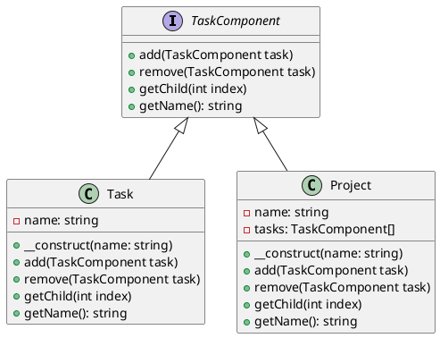

# PHP

Представьте, что мы — команда разработчиков, работающая над системой управления задачами. Наша цель — создать гибкую и расширяемую систему, которая позволит пользователям создавать задачи, подзадачи и группировать их в проекты. Для этого мы решили использовать паттерн проектирования "Компоновщик" (Composite), который позволяет нам обрабатывать объекты и их композиции единообразно.

#### Описание паттерна Компоновщик

Паттерн Компоновщик позволяет клиентам обрабатывать отдельные объекты и композиции объектов одинаково. Это особенно полезно, когда у нас есть иерархическая структура данных, как в нашем случае с задачами и подзадачами.

#### Пример кода на PHP

**1. Определение интерфейса компонента**


```php
<?php
interface TaskComponent {
    public function add(TaskComponent $task);
    public function remove(TaskComponent $task);
    public function getChild(int $index);
    public function getName(): string;
}
?>
```


**2. Реализация листового компонента (задача)**


```php
<?php
class Task implements TaskComponent {
    private string $name;

    public function __construct(string $name) {
        $this->name = $name;
    }

    public function add(TaskComponent $task) {
        // Листовой компонент не может иметь детей
    }

    public function remove(TaskComponent $task) {
        // Листовой компонент не может иметь детей
    }

    public function getChild(int $index) {
        // Листовой компонент не имеет детей
        return null;
    }

    public function getName(): string {
        return $this->name;
    }
}
?>
```


**3. Реализация композитного компонента (проект)**


```php
<?php
class Project implements TaskComponent {
    private string $name;
    private array $tasks = [];

    public function __construct(string $name) {
        $this->name = $name;
    }

    public function add(TaskComponent $task) {
        $this->tasks[] = $task;
    }

    public function remove(TaskComponent $task) {
        $index = array_search($task, $this->tasks);
        if ($index !== false) {
            unset($this->tasks[$index]);
        }
    }

    public function getChild(int $index) {
        if (isset($this->tasks[$index])) {
            return $this->tasks[$index];
        }
        return null;
    }

    public function getName(): string {
        return $this->name;
    }
}
?>
```


**4. Пример использования**


```php
<?php
$project = new Project("Project 1");

$task1 = new Task("Task 1");
$task2 = new Task("Task 2");

$project->add($task1);
$project->add($task2);

echo $project->getName() . "\n";
echo $project->getChild(0)->getName() . "\n";
echo $project->getChild(1)->getName() . "\n";
?>
```


#### UML диаграмма

<figure><figcaption><p>UML диаграмма для паттерна "Компоновщик"</p></figcaption></figure>





#### Вывод

Паттерн Компоновщик позволяет нам создать гибкую и расширяемую систему управления задачами. Мы можем легко добавлять и удалять задачи и подзадачи, обрабатывая их единообразно. Это делает нашу систему более удобной для пользователей и проще в поддержке и расширении.
