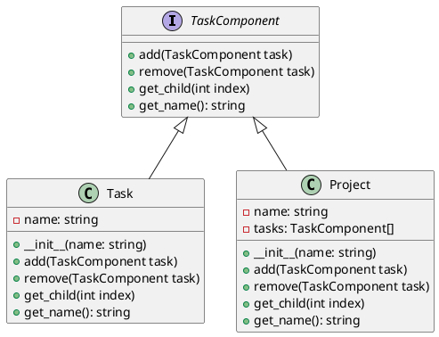

# Python

Представьте, что мы — команда разработчиков, работающая над системой управления задачами. Наша цель — создать гибкую и расширяемую систему, которая позволит пользователям создавать задачи, подзадачи и группировать их в проекты. Для этого мы решили использовать паттерн проектирования "Компоновщик" (Composite), который позволяет нам обрабатывать объекты и их композиции единообразно.

#### Описание паттерна Компоновщик

Паттерн Компоновщик позволяет клиентам обрабатывать отдельные объекты и композиции объектов одинаково. Это особенно полезно, когда у нас есть иерархическая структура данных, как в нашем случае с задачами и подзадачами.

#### Пример кода на Python

**1. Определение интерфейса компонента**


```python
from abc import ABC, abstractmethod

class TaskComponent(ABC):
    @abstractmethod
    def add(self, task):
        pass

    @abstractmethod
    def remove(self, task):
        pass

    @abstractmethod
    def get_child(self, index):
        pass

    @abstractmethod
    def get_name(self):
        pass
```


**2. Реализация листового компонента (задача)**


```python
class Task(TaskComponent):
    def __init__(self, name):
        self.name = name

    def add(self, task):
        # Листовой компонент не может иметь детей
        pass

    def remove(self, task):
        # Листовой компонент не может иметь детей
        pass

    def get_child(self, index):
        # Листовой компонент не имеет детей
        return None

    def get_name(self):
        return self.name
```


**3. Реализация композитного компонента (проект)**


```python
class Project(TaskComponent):
    def __init__(self, name):
        self.name = name
        self.tasks = []

    def add(self, task):
        self.tasks.append(task)

    def remove(self, task):
        self.tasks.remove(task)

    def get_child(self, index):
        if index >= 0 and index < len(self.tasks):
            return self.tasks[index]
        return None

    def get_name(self):
        return self.name
```


**4. Пример использования**


```python
if __name__ == "__main__":
    project = Project("Project 1")

    task1 = Task("Task 1")
    task2 = Task("Task 2")

    project.add(task1)
    project.add(task2)

    print(project.get_name())
    print(project.get_child(0).get_name())
    print(project.get_child(1).get_name())
```


#### UML диаграмма

<figure><figcaption><p>UML диаграмма для паттерна "Компоновщик"</p></figcaption></figure>





#### Вывод

Паттерн Компоновщик позволяет нам создать гибкую и расширяемую систему управления задачами. Мы можем легко добавлять и удалять задачи и подзадачи, обрабатывая их единообразно. Это делает нашу систему более удобной для пользователей и проще в поддержке и расширении.
