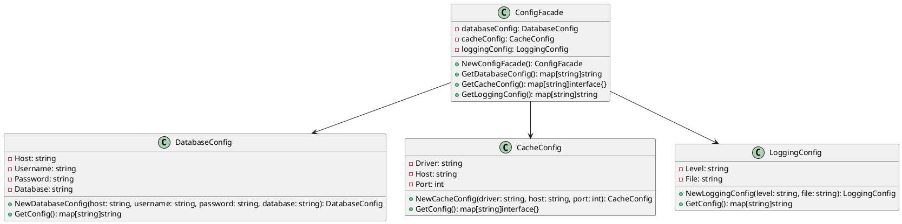

# Go

Представьте, что мы — команда разработчиков, работающая над веб-приложением. Наше приложение имеет множество настроек и конфигураций, таких как подключение к базе данных, настройки кэширования, параметры логирования и многое другое. Все эти настройки хранятся в разных местах и управляются разными классами. Наша задача — упростить управление этими конфигурациями, чтобы другие разработчики могли легко и быстро изменять настройки без необходимости понимать внутреннюю структуру приложения.

Для этого мы решили использовать паттерн проектирования "Фасад" (Facade). Фасад предоставляет простой интерфейс для сложной системы классов, библиотек или фреймворков. В нашем случае, фасад будет предоставлять единый интерфейс для управления всеми конфигурациями приложения.

#### Пример кода на Go

**1. Классы для управления конфигурациями**


```go
// Класс для управления настройками базы данных
type DatabaseConfig struct {
    Host     string
    Username string
    Password string
    Database string
}

func NewDatabaseConfig(host, username, password, database string) *DatabaseConfig {
    return &DatabaseConfig{
        Host:     host,
        Username: username,
        Password: password,
        Database: database,
    }
}

func (dc *DatabaseConfig) GetConfig() map[string]string {
    return map[string]string{
        "host":     dc.Host,
        "username": dc.Username,
        "password": dc.Password,
        "database": dc.Database,
    }
}

// Класс для управления настройками кэширования
type CacheConfig struct {
    Driver string
    Host   string
    Port   int
}

func NewCacheConfig(driver, host string, port int) *CacheConfig {
    return &CacheConfig{
        Driver: driver,
        Host:   host,
        Port:   port,
    }
}

func (cc *CacheConfig) GetConfig() map[string]interface{} {
    return map[string]interface{}{
        "driver": cc.Driver,
        "host":   cc.Host,
        "port":   cc.Port,
    }
}

// Класс для управления настройками логирования
type LoggingConfig struct {
    Level string
    File  string
}

func NewLoggingConfig(level, file string) *LoggingConfig {
    return &LoggingConfig{
        Level: level,
        File:  file,
    }
}

func (lc *LoggingConfig) GetConfig() map[string]string {
    return map[string]string{
        "level": lc.Level,
        "file":  lc.File,
    }
}
```


**2. Класс Фасада**


```go
// Класс Фасада для управления всеми конфигурациями
type ConfigFacade struct {
    databaseConfig *DatabaseConfig
    cacheConfig    *CacheConfig
    loggingConfig  *LoggingConfig
}

func NewConfigFacade() *ConfigFacade {
    return &ConfigFacade{
        databaseConfig: NewDatabaseConfig("localhost", "root", "password", "mydb"),
        cacheConfig:    NewCacheConfig("redis", "localhost", 6379),
        loggingConfig:  NewLoggingConfig("info", "/var/log/app.log"),
    }
}

// Метод для получения конфигурации базы данных
func (cf *ConfigFacade) GetDatabaseConfig() map[string]string {
    return cf.databaseConfig.GetConfig()
}

// Метод для получения конфигурации кэширования
func (cf *ConfigFacade) GetCacheConfig() map[string]interface{} {
    return cf.cacheConfig.GetConfig()
}

// Метод для получения конфигурации логирования
func (cf *ConfigFacade) GetLoggingConfig() map[string]string {
    return cf.loggingConfig.GetConfig()
}
```


**3. Использование Фасада**


```go
package main

import (
    "fmt"
)

func main() {
    // Пример использования Фасада
    configFacade := NewConfigFacade()

    // Получение конфигурации базы данных
    dbConfig := configFacade.GetDatabaseConfig()
    fmt.Println("Database Config:", dbConfig)

    // Получение конфигурации кэширования
    cacheConfig := configFacade.GetCacheConfig()
    fmt.Println("Cache Config:", cacheConfig)

    // Получение конфигурации логирования
    loggingConfig := configFacade.GetLoggingConfig()
    fmt.Println("Logging Config:", loggingConfig)
}
```


#### UML диаграмма

<figure><figcaption><p>UML диаграмма для паттерна "Фасад"</p></figcaption></figure>





#### Вывод для кейса

Использование паттерна "Фасад" позволило нам создать простой и удобный интерфейс для управления конфигурациями нашего приложения. Теперь другие разработчики могут легко получать и изменять настройки, не вдаваясь в детали реализации каждого из классов. Это упрощает работу с конфигурацией и делает код более читаемым и поддерживаемым.
